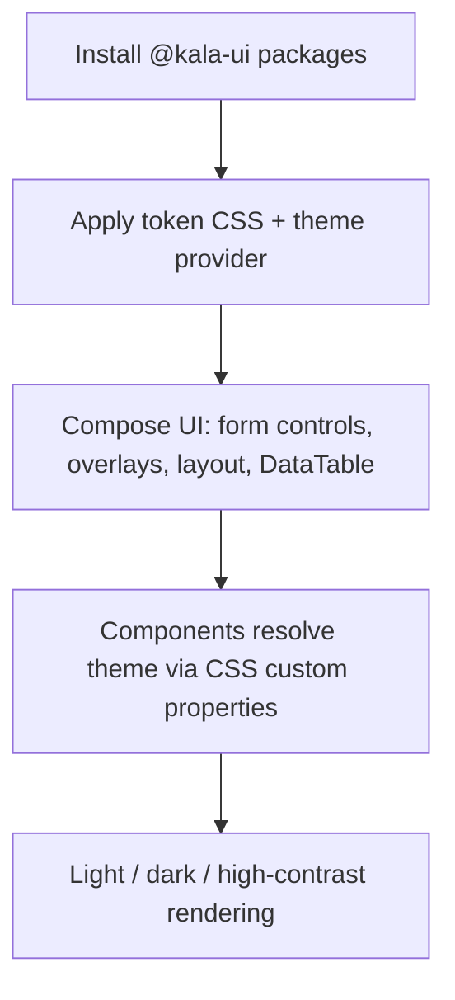

# Project overview

## Purpose

Kala UI is a React component library with a token-driven theming system. It is published as a set of packages in a pnpm monorepo and consumed by teams building React applications (including Next.js server-rendered apps). The project provides ~90 accessible, production-ready UI primitives, a collection of 37 SSR-safe React hooks, and higher-level app composites — all themed through a whole-CSS-color custom-property token system that works with or without Tailwind CSS.

Audience:
- Application developers who install published packages and compose them into product UIs.
- Contributors who extend the library, run the playground, and release packages (see `docs/RELEASING.md`, `docs/MIGRATION-0.1.md`, `docs/AUDIT-2026-08-27.md`).

## Implementation map

- `README.md` — top-level product documentation: what Kala UI is and its main capabilities.
- `packages/react/README.md` (+ `packages/react/CHANGELOG.md`) — the core React component library package: buttons, dialogs, selects, overlays, and other primitives built on Radix UI and Tailwind CSS. See [Core UI Component Library](features/core-ui-component-library.md).
- `packages/react-app/README.md` (+ CHANGELOG) — `@kala-ui/react-app`, application-level composites (AppShell, Header, Sidebar, DataTable, etc.). See [Application Chrome Composites](features/application-chrome-composites.md) and [Playground App](features/playground-app.md).
- `packages/react-app/src/components/data-table/README.md` — DataTable component docs: search, pagination, server-side data fetching, row selection, bulk actions, custom cell rendering, loading/empty states, clickable rows.
- `packages/react-hooks/README.md`, `packages/react-hooks/EXAMPLES.md` (+ CHANGELOG) — the hooks package: 37 SSR-safe, React 19 typed hooks. See [React Hooks Collection](features/react-hooks-collection.md).
- `packages/react/src/components/skeleton/README.md` — per-component docs (e.g., Skeleton) shipped alongside components.
- `apps/playground/app/layout.tsx`, `apps/playground/app/globals.css` — Next.js playground app that exercises the library, including global theme CSS. See [Playground App](features/playground-app.md).
- `scripts/add-js-extensions.mjs`, `scripts/add-kala-markers.mjs` — build/prep scripts for package output.
- Docs: `docs/RELEASING.md` (release process), `docs/MIGRATION-0.1.md` (0.1 migration), `docs/AUDIT-2026-08-27.md` (audit findings). Structural context in [Architecture](architecture.md); setup commands in [Getting started](getting-started.md).

## Key flows

A consumer installs a package (e.g., `@kala-ui/react-app` per its Installation section), wraps the app in the theme provider / global token CSS (as the playground does via `apps/playground/app/globals.css` and `layout.tsx`), then composes primitives — form controls, overlays, layout primitives, DataTable — into pages. Theming flows through CSS custom-property tokens, so components (including toasts) follow the active  theme without Tailwind being required.

Main capability areas (see linked feature pages):

- **Core component library** — accessible Radix/Tailwind primitives: [Core UI Component Library](features/core-ui-component-library.md)
- **Form controls** — inputs, selects, comboboxes, date/time pickers, OTP, password strength: [Form Controls](features/form-controls.md)
- **Layout primitives** — Box, Flex, Grid, Stack, Center, Container, Group, Paper: [Layout Primitives](features/layout-primitives.md)
- **Overlays & menus** — dialogs, drawers, popovers, tooltips, command palette, toasts: [Overlays & Menus](features/overlays-menus.md)
- **Navigation** — breadcrumbs, menubar, pagination, tabs, tree view: [Navigation Components](features/navigation-components.md)
- **Application chrome** — AppShell, Header, Sidebar, DataTable composites: [Application Chrome Composites](features/application-chrome-composites.md)
- **Theming** — token-driven  themes and theme switching: [Token-Driven Theming](features/token-driven-theming.md), [Dark Mode & Theme Switching](features/dark-mode-theme-switching.md)
- **React 19 / RSC readiness** — components usable in React Server Components: [React Server Components Support](features/react-server-components-support.md)
- **DOM identification** — documented CSS class naming for recognizing components in the DOM: [DOM Component Identification](features/dom-component-identification.md)

## Working notes

- Package manager is pnpm; frameworks span React, Next.js, Vite, and Tailwind CSS.
- Each package keeps its own `README.md` and `CHANGELOG.md` — check the relevant package README before implementing changes, and update its CHANGELOG.
- DataTable is the most feature-rich composite: consult `packages/react-app/src/components/data-table/README.md` for supported modes (search, pagination, server-side fetching, selection, bulk actions).
- Release and migration conventions live in `docs/RELEASING.md` and `docs/MIGRATION-0.1.md`; `docs/AUDIT-2026-08-27.md` records a recent audit.
- `scripts/add-js-extensions.mjs` and `scripts/add-kala-markers.mjs` post-process build output — changes to package exports may require running them.
- Tailwind is optional for consumers; the token system relies on CSS custom properties overridable on `:root` and dark selectors.

## Evidence

| Source | Role |
| --- | --- |
| `README.md` | Project-level product description |
| `packages/react/README.md`, `CHANGELOG.md` | Core component library package |
| `packages/react-app/README.md`, `CHANGELOG.md` | App composites package |
| `packages/react-app/src/components/data-table/README.md` | DataTable feature docs |
| `packages/react-hooks/README.md`, `EXAMPLES.md`, `CHANGELOG.md` | Hooks package |
| `packages/react/src/components/skeleton/README.md` | Per-component docs example |
| `apps/playground/app/layout.tsx`, `globals.css` | Playground runtime surface / theme CSS |
| `docs/RELEASING.md`, `docs/MIGRATION-0.1.md`, `docs/AUDIT-2026-08-27.md` | Process and audit docs |
| `scripts/add-js-extensions.mjs`, `scripts/add-kala-markers.mjs` | Build prep scripts |