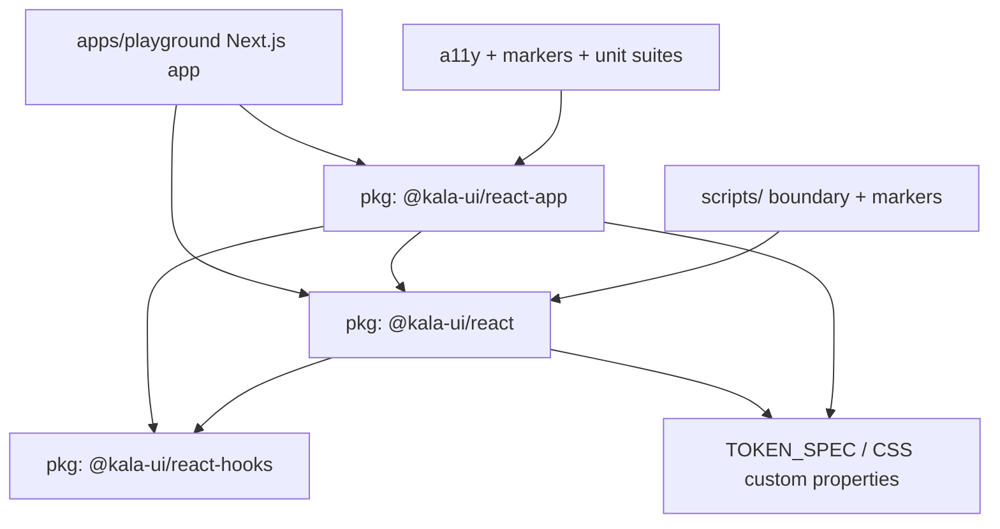

# Architecture

## Purpose
Kala UI is a pnpm monorepo producing a token-driven React component library. This page maps the source areas, packages, build scripts, and documentation contracts so a contributor or agent can locate where a change belongs without broad file reads.

## Implementation map
- **Workspace layout** — `pnpm-workspace.yaml` + `package.json` define three publishable packages and one demo app:
  - `packages/react` — `@kala-ui/react`, the core library (~90 accessible primitives built on Radix UI + Tailwind). Docs: `packages/react/README.md`, token contract in `packages/react/TOKEN_SPEC.md`.
  - `packages/react-app` — `@kala-ui/react-app`, higher-level application composites: `app-shell/app-shell.tsx`, `header`, `footer`, `nav-link`, `user-menu-dropdown`, `data-table/*` (see `data-table/data-table.types.ts`, `pagination-nav.tsx`, `column-filters.tsx`, `column-header-filter.tsx`), `metric-card`, `session-card`, `charts` (incl. `chart-skeleton.tsx`). Lint config: `packages/react-app/biome.json`.
  - `packages/react-hooks` — `@kala-ui/react-hooks`, 37 SSR-safe hooks. Docs: `packages/react-hooks/README.md`, `EXAMPLES.md`; tests like `use-click-outside.test.ts`.
  - `apps/playground` — Next.js playground exercising the packages; entry surfaces `app/layout.tsx`, `app/page.tsx`, `app/globals.css` (see [Playground App](features/playground-app.md)).
- **Theming layer** — whole-CSS-color custom-property tokens defined per `packages/react/TOKEN_SPEC.md` and `THEMING.md`, overridable on `:root`/dark selectors without Tailwind; the playground's `globals.css` is a reference consumer. See [Token-Driven Theming](features/token-driven-theming.md) and [Dark Mode & Theme Switching](features/dark-mode-theme-switching.md).
- **Repo scripts** — `scripts/check-package-boundaries.mjs` enforces package dependency direction; `scripts/add-k-extensions.mjs` → `add-js-extensions.mjs` fixes ESM imports; `scripts/add-kala-markers.mjs` injects the CSS-class markers tested by `packages/react/src/__tests__/component-markers.test.tsx` ([DOM Component Identification](features/dom-component-identification.md)).
- **Governance docs** — `CONTRIBUTING.md`, `docs/RELEASING.md` (versioning across the three packages), `docs/MIGRATION-0.1.md` and `docs/migrations/acalumi-t1.2.0-deviation-approval.md` (migration/deviation contracts), `docs/AUDIT-2026-08-27.md` (audit & remediation plan).

## Key flows
Dependency direction flows from the playground down: `apps/playground` consumes `@kala-ui/react-app` and `@kala-ui/react`; `@kala-ui/react-app` composites `@kala-ui/react` primitives; `@kala-ui/react-hooks` is consumed by both packages. Cross-cutting accessibility is enforced by package-level a11y suites (`packages/react/src/__tests__/a11y.test.tsx`, `packages/react-app/src/__tests__/a11y.test.tsx`) that reference AppShell, Header, Footer, DataTable, Chart, MetricCard, SessionCard, and DnD surfaces.

Structural hotspots (god nodes by in-degree) an agent should expect to touch indirectly: `Button`, `TableCell`, `Skeleton`, `Text`, `Box`, `Flex`, `PaginationItem` in  — changes to these ripple widely. In `react-app`, `AppShell`, `Header`, `DataTable`, `MenubarItem`, `TableRow` are similar hubs. `apps/playground/app/page.tsx` is a consumer-only aggregation node (out-degree 363), not a library seam.

Feature mapping: form controls and overlays live in `packages/react` ([Form Controls](features/form-controls.md), [Overlays & Menus](features/overlays-menus.md)); application chrome, data-table, metric/session cards, and charts live in `packages/react-app` ([Application Chrome Composites](features/application-chrome-composites.md), [Charts](features/charts.md)). Components are RSC-ready ([React Server Components Support](features/react-server-components-support.md)).

## Working notes
- Run/test commands are documented in [Getting started](getting-started.md) and [Testing strategy](testing.md); each package has its own `__tests__/setup.ts` (`packages/react/src/__tests__/setup.ts`, `packages/react-app/src/__tests__/setup.ts`).
- Component convention: each component directory holds , , `index.ts` barrel and colocated  including  loading states (e.g. `metric-card/`, `accordion/accordion-skeleton.tsx`).
- Before adding cross-package imports, run the boundary check (`scripts/check-package-boundaries.mjs`) — the playground must not be imported by packages.
- Marker classes injected by `scripts/add-kala-markers.mjs` are contractual; verify `component-markers.test.tsx` still passes after refactors.
- Releases follow `docs/RELEASING.md`; breaking changes need a migration doc patterned on `docs/MIGRATION-0.1.md` and, where approved deviations exist, an entry under `docs/migrations/`.

## Evidence
| Artifact | Role |
|---|---|
| `pnpm-workspace.yaml`, `package.json` | Workspace/package config |
| `packages/react/README.md`, `TOKEN_SPEC.md` | Core library docs + token contract |
| `packages/react-app/README.md`, `biome.json` | Composites package docs + lint |
| `packages/react-hooks/README.md`, `EXAMPLES.md` | Hooks docs |
| `apps/playground/app/layout.tsx`, `page.tsx`, `globals.css` | Playground runtime surfaces |
| `scripts/check-package-boundaries.mjs`, `add-kala-markers.mjs`, `add-js-extensions.mjs` | Repo automation |
| `docs/RELEASING.md`, `docs/MIGRATION-0.1.md`, `docs/migrations/acalumi-t1.2.0-deviation-approval.md` | Release/migration contracts |
| `packages/react/src/__tests__/a11y.test.tsx`, `packages/react-app/src/__tests__/a11y.test.tsx` | Cross-package a11y enforcement |