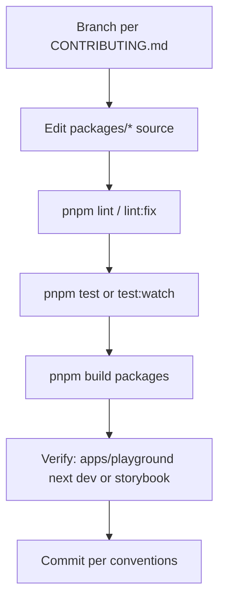

# Development guide

## Purpose

This page explains how the kala-ui monorepo is laid out, the conventions contributors must follow, and the package-level surfaces available for building, linting, testing, and shipping changes. It is the entry point for agents and humans making their first change.

## Implementation map

- **Workspace root** — `package.json` defines pnpm-filtered orchestration scripts (`build`, `lint`, `test`, `format`, `storybook`) that fan out to `packages/**` and `apps/**`.
- **`packages/react`** — the core component library. Build is `tsc` + `scripts/add-js-extensions.mjs` + PostCSS (`src/styles/globals.css` → `dist/styles/globals.css`, copying /). Includes Storybook (`storybook dev -p 6006`) and a token test gate: `pnpm build && vitest run src/styles/tokens.test.ts`. Token contract documented in `packages/react/TOKEN_SPEC.md`; see [Token-Driven Theming](features/token-driven-theming.md) and [Core UI Component Library](features/core-ui-component-library.md).
- **`packages/react-app`** — app-level composite components (e.g. `data-table`, see `packages/react-app/src/components/data-table/SERVER_SIDE_GUIDE.md`). Build mirrors the core package but emits . See [Application Chrome Composites](features/application-chrome-composites.md).
- **`packages/react-hooks`** — hook collection built with `tsdown` (`tsdown --watch` for dev), with `EXAMPLES.md` usage docs. See [React Hooks Collection](features/react-hooks-collection.md).
- **`apps/playground`** — Next.js app (`next dev` / `next build` / `next start`) for exercising the library. See [Playground App](features/playground-app.md) and [Architecture](architecture.md) for the structural picture.
- **Developer docs** — `CONTRIBUTING.md` (workflow, branch naming, commit conventions, TypeScript/component guidelines, testing), `docs/RELEASING.md`, `docs/MIGRATION-0.1.md`, `docs/AUDIT-2026-08-27.md`, `THEMING.md`, plus per-package `CHANGELOG.md` files.
- **Boundary enforcement** — root `lint` runs `node scripts/check-package-boundaries.mjs` before package linting; do not add cross-package imports that violate it.

## Key flows

Typical contribution loop: branch → change in a package → run package lint/tests → run root build → verify in playground or Storybook.

Common root commands (pnpm):

- `pnpm dev` — `pnpm --filter @kala-ui/react dev` (library watch); use `pnpm --filter playground dev` style invocation for the Next.js playground (`next dev`).
- `pnpm build` — ; `pnpm build:apps` for `apps/**`.
- `pnpm lint` — boundary check + package lint; `pnpm lint:fix`, `pnpm lint:fix-unsafe`.
- `pnpm format` — Biome format across packages.
- `pnpm test` — vitest across packages; `pnpm test:watch` and `pnpm test:coverage` target `@kala-ui/react` and `@kala-ui/react-app`.
- `pnpm storybook`, `pnpm build-storybook`, `pnpm test-storybook` (`node scripts/test-storybook.mjs`) — see [Storybook Documentation](features/storybook-documentation.md).

Package-level notes:

- `packages/react` uses `biome lint .`; `packages/react-hooks` uses `biome check .`; both use vitest.
- `packages/react` has the extra `test:tokens` script — the CSS token system is test-gated ([Token-Driven Theming](features/token-driven-theming.md)).
- Tests live alongside source; follow `CONTRIBUTING.md` "Writing Tests" guidance and [Testing strategy](testing.md).

## Working notes

- **Commit & branch conventions** are defined in `CONTRIBUTING.md` (Branch Naming, Commit Message Conventions sections) — follow them exactly.
- **Styling contract**: the core package compiles CSS via PostCSS, not a bundler style step; if you add styles, ensure they are included in the `globals.css`// build outputs. `THEMING.md` and `TOKEN_SPEC.md` define the token contract; `test:tokens` must pass after token changes.
- **JS extensions**: `scripts/add-js-extensions.mjs` runs after `tsc` in react/react-app builds to fix ESM relative imports — don't hand-edit `dist`.
- **Known issues**: check `docs/AUDIT-2026-08-27.md` findings register (P0/P1/P2) before touching component behavior; the remediation plan is the source of truth for prioritized fixes.
- **Releases and breaking changes**: follow `docs/RELEASING.md` and update the relevant package `CHANGELOG.md`; `docs/MIGRATION-0.1.md` documents the 0.1 migration path.
- **TypeScript**: strict per `CONTRIBUTING.md` TypeScript Guidelines; component API guidelines are in the Component Guidelines section.
- SSR/RSC constraints matter for new components — see [React Server Components Support](features/react-server-components-support.md).

## Evidence

| Source | Role |
|---|---|
| `package.json` (root) | Workspace scripts: build, lint, test, storybook |
| `packages/react/package.json` | Core lib build (tsc + postcss), test:tokens, storybook |
| `packages/react-app/package.json` | App composites build, vitest, biome |
| `packages/react-hooks/package.json` | tsdown build, biome check, vitest |
| `apps/playground/package.json` | next dev/build/start |
| `CONTRIBUTING.md` | Workflow, conventions, guidelines |
| `docs/AUDIT-2026-08-27.md` | Findings register & remediation plan |
| `docs/RELEASING.md`, `docs/MIGRATION-0.1.md` | Release & migration process |
| `packages/react/TOKEN_SPEC.md`, `THEMING.md` | Token/theming contract |
| `packages/react-hooks/EXAMPLES.md` | Hook usage examples |
| `packages/react-app/src/components/data-table/SERVER_SIDE_GUIDE.md` | Data-table server-side guide |
