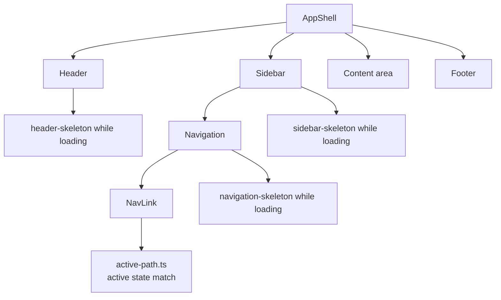

# Application Chrome Composites

## Purpose
Kala UI's application chrome composites assemble the outer shell of a full application: `AppShell`, `Header`, `Sidebar`, `Footer`, `Navigation`, and `NavLink`. While the core library (`packages/react`) provides atomic primitives, these composites live in `packages/react-app` and combine primitives with layout and routing-aware behavior (e.g., active-link detection via `ActivePath`) so consumers can stand up a complete application frame without wiring layout themselves. Each composite also ships a skeleton variant for loading states.

## Implementation map
- **AppShell** — `packages/react-app/src/components/app-shell/app-shell.tsx`; the top-level layout frame composing Header, Sidebar, Footer, and content. Tested in `app-shell.test.tsx`.
- **Header** — `packages/react-app/src/components/header/header.tsx` with types in `header.types.ts` and loading variant `header-skeleton.tsx` (tested in `header.test.tsx`, `header-skeleton.test.tsx`).
- **Sidebar** — `packages/react-app/src/components/sidebar/sidebar.tsx`, stories in `sidebar.stories.tsx`, skeleton in `sidebar-skeleton.tsx` (tests in both `sidebar.test.tsx` and `sidebar/__tests__/sidebar.test.tsx`).
- **Footer** — `packages/react-app/src/components/footer/footer.tsx` (tested in `footer.test.tsx`).
- **Navigation** — `packages/react-app/src/components/navigation/navigation.tsx`, with stories (`navigation.stories.tsx`) and skeleton (`navigation-skeleton.tsx`).
- **NavLink** — `packages/react-app/src/components/nav-link/nav-link.tsx`; the routing-aware link primitive underlying Navigation (tested in `nav-link.test.tsx`).
- **ActivePath** — `packages/react-app/src/lib/active-path.ts`; path-matching logic that determines which nav items render as active.
- Related building blocks from the core library: navigation-menu (`packages/react/src/components/navigation-menu/`), breadcrumbs, tree-view, toolbar, and skip-to-content — see [Navigation Components](features/navigation-components.md) and [Core UI Component Library](features/core-ui-component-library.md).
- Structural context: [Architecture](architecture.md) (source areas `packages/react` vs `packages/react-app`).

## Key flows
At runtime, the application renders `AppShell` as the outermost frame. Header and Sidebar occupy fixed regions; `Navigation` inside the shell renders `NavLink` items whose active state is resolved against the current route via `active-path.ts`. Skeleton composites (`header-skeleton`, `sidebar-skeleton`, `navigation-skeleton`) render during data loading, matching the skeleton pattern used across the library (`packages/react/src/components/skeleton/skeleton-patterns.test.tsx`).

Adjacent surfaces that often live inside the shell: the data-table composites in `packages/react-app/src/components/data-table/` (content area) and overlays/menus from [Overlays & Menus](features/overlays-menus.md). Layout primitives used for composition are documented in [Layout Primitives](features/layout-primitives.md).

## Working notes
- The chrome composites are in `packages/react-app`, distinct from atomic primitives in `packages/react`; check which package exports a symbol before importing in consumer code.
- `NavLink`'s active-state contract is centralized in `packages/react-app/src/lib/active-path.ts` — change path-matching semantics there, not in each link.
- Every composite has a colocated  and test; keep the skeleton API aligned when adding props.
- Sidebar has two test files (`sidebar.test.tsx` and `sidebar/__tests__/sidebar.test.tsx`) — update both suites for behavior changes.
- Run tests via the workspace tooling described in [Testing strategy](testing.md) and [Getting started](getting-started.md) (pnpm).
- Stories (`sidebar.stories.tsx`, `navigation.stories.tsx`) serve as usage docs; see [Storybook Documentation](features/storybook-documentation.md).

## Evidence
| Artifact | Path |
|---|---|
| AppShell source | packages/react-app/src/components/app-shell/app-shell.tsx |
| Header source/types/skeleton | packages/react-app/src/components/header/{header.tsx, header.types.ts, header-skeleton.tsx} |
| Sidebar  | packages/react-app/src/components/sidebar/{sidebar.tsx, sidebar-skeleton.tsx, sidebar.stories.tsx} |
| Footer source | packages/react-app/src/components/footer/footer.tsx |
| Navigation  | packages/react-app/src/components/navigation/{navigation.tsx, navigation-skeleton.tsx, navigation.stories.tsx} |
| NavLink source | packages/react-app/src/components/nav-link/nav-link.tsx |
| Active-path logic | packages/react-app/src/lib/active-path.ts |
| Composite tests | app-shell.test.tsx, header.test.tsx, sidebar.test.tsx, footer.test.tsx, navigation.test.tsx, nav-link.test.tsx |