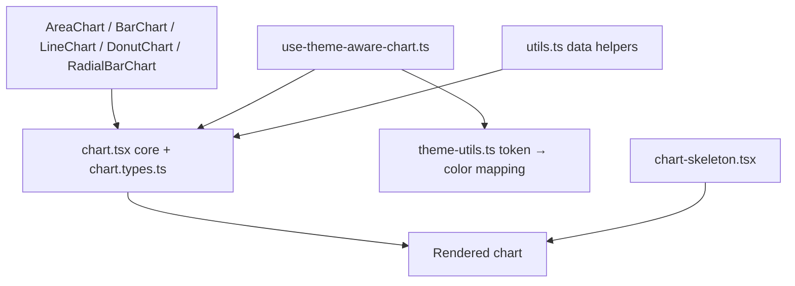

# Charts

## Purpose

Kala UI's chart suite provides data-visualization components — `AreaChart`, `BarChart`, `LineChart`, `DonutChart`, `RadialBarChart`, and `SparklineChart` — for rendering datasets inside React apps. Unlike most of the library, charts live in `packages/react-app` (the application package) rather than `packages/react`, and they are theme-aware: colors and styling follow the active Kala UI theme tokens rather than hardcoded palettes. See [Token-Driven Theming](features/token-driven-theming.md) and [Dark Mode & Theme Switching](features/dark-mode-theme-switching.md) for the theme system they integrate with.

## Implementation map

- `packages/react-app/src/components/charts/chart.tsx` — core `Chart` component shared by the chart family.
- `chart.types.ts` — shared chart type contracts.
- `area-chart.tsx`, `bar-chart.tsx`, `line-chart.tsx`, `donut-chart.tsx`, `radial-bar-chart.tsx` — per-chart variants.
- `packages/react-app/src/components/sparkline-chart/sparkline-chart.tsx` — standalone lightweight sparkline component (with its own `sparkline-chart.stories.tsx`).
- `theme-utils.ts` — utilities mapping theme tokens to chart colors.
- `use-theme-aware-chart.ts` — hook resolving the active theme for chart rendering.
- `utils.ts` — general chart helpers (formatting, data shaping).
- `chart-skeleton.tsx` — loading placeholder for charts, following the same skeleton pattern as `packages/react/src/components/skeleton/skeleton-patterns.tsx` (compare card/list/data-table skeletons).
- `chart.stories.tsx` — Storybook stories for all chart variants (see [Storybook Documentation](features/storybook-documentation.md)).
- `apps/playground/app/page.tsx` — playground surface exercising charts at runtime ([Playground App](features/playground-app.md)).
- `docs/AUDIT-2026-08-27.md`, `docs/MIGRATION-0.1.md` — developer docs covering audit and migration context for the 0.1 release.
- Each component has a colocated test: `chart.test.tsx`, `area-chart.test.tsx`, `bar-chart.test.tsx`, `line-chart.test.tsx`, `donut-chart.test.tsx`, `radial-bar-chart.test.tsx`, `sparkline-chart.test.tsx`, `chart-skeleton.test.tsx`, plus `theme-utils.test.ts`, `use-theme-aware-chart.test.ts`, `utils.test.ts`.

## Key flows

Charts are composed client-side in `packages/react-app`. A chart variant (e.g. `AreaChart`) wraps the core `Chart`, resolves theme colors via `use-theme-aware-chart` + `theme-utils`, and renders data using helpers from `utils.ts`. While data loads, `chart-skeleton.tsx` renders a placeholder consistent with the library's skeleton patterns.

Sparkline renders independently from the main chart family in its own folder, so changes to `chart.tsx` do not automatically propagate to it.

## Working notes

- Charts are exported from `packages/react-app`, not `packages/react` — when wiring imports or adding chart-based features, target the react-app package (cross-check [Architecture](architecture.md) for the package split).
- Theme awareness is the main contract: any new chart color should flow through `theme-utils.ts` so charts follow the active  theme; test via `theme-utils.test.ts` and `use-theme-aware-chart.test.ts`.
- Run the full test suite with pnpm (see [Getting started](getting-started.md) and [Testing strategy](testing.md)); every chart component has a colocated test file you should extend when changing behavior.
- Use `chart.stories.tsx` and `sparkline-chart.stories.tsx` to visually verify changes in Storybook before running tests.
- Keep `chart-skeleton.tsx` consistent with the shared skeleton patterns in `packages/react/src/components/skeleton/skeleton-patterns.tsx`.

## Evidence

| File | Role |
|---|---|
| `packages/react-app/src/components/charts/chart.tsx` | Core chart component |
| `packages/react-app/src/components/charts/chart.types.ts` | Shared chart types |
| `packages/react-app/src/components/charts/{area,bar,line}-chart.tsx` | Cartesian chart variants |
|  | Circular chart variants |
| `packages/react-app/src/components/sparkline-chart/sparkline-chart.tsx` | Sparkline component |
| `packages/react-app/src/components/charts/use-theme-aware-chart.ts` | Theme-resolution hook |
| `packages/react-app/src/components/charts/theme-utils.ts` | Token → chart color utilities |
| `packages/react-app/src/components/charts/chart-skeleton.tsx` | Chart loading skeleton |
| `packages/react-app/src/components/charts/chart.stories.tsx` | Storybook stories |
| `apps/playground/app/page.tsx` | Runtime playground surface |
| `docs/AUDIT-2026-08-27.md` | Audit documentation |
| `docs/MIGRATION-0.1.md` | 0.1 migration documentation |