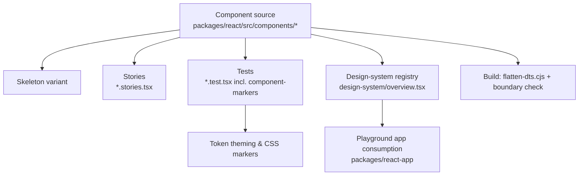

# Core UI Component Library

## Purpose

The Core UI Component Library is the heart of kala-ui: roughly 90 accessible, production-ready React primitives — buttons, dialogs, selects, alerts, command palettes, and more — built on Radix UI and styled with Tailwind CSS. It ships from `packages/react` and is consumed by the playground app (`packages/react-app`) and downstream projects. Every primitive is theme-token aware (see `wiki:features/token-driven-theming.md`) and identifiable in the DOM via documented CSS classes (see `wiki:features/dom-component-identification.md`).

## Implementation map

- **`packages/react`** — the library package itself; components live in , each with source, stories, and colocated tests (e.g. `dialog.tsx`, `dialog.test.tsx`, `dialog.stories.tsx`, `dialog-skeleton.tsx`).
- **Representative primitives**:
  - Dialog: `packages/react/src/components/dialog/dialog.tsx` (+ `dialog-skeleton.tsx` loading skeleton)
  - Alert Dialog: `packages/react/src/components/alert-dialog/alert-dialog.tsx` (+ `alert-dialog.stories.tsx`)
  - Alert / Banner / Card: `alert.tsx`, plus skeleton tests (`alert-skeleton.test.tsx`, `banner-skeleton.test.tsx`, `card-skeleton.test.tsx`)
  - Command palette: `command/command.stories.tsx` — see `wiki:features/overlays-menus.md`
  - Drawer: `drawer/drawer-skeleton.test.tsx` — see `wiki:features/overlays-menus.md`
  - Empty state: `empty-state/empty-state.tsx`
  - Error boundary: `error-boundary/error-boundary.tsx` with fallback tests
  - File upload, spoiler: `file-upload/file-upload.test.tsx`, `spoiler/spoiler.test.tsx`
- **Design-system registry**: `packages/react/src/components/design-system/` (`overview.tsx`, `design-system-utils.ts`) plus tests (`overview.test.tsx`, `category-section.test.tsx`, `component-preview-card.test.tsx`) — organizes primitives into documented categories/previews.
- **DOM markers contract**: `packages/react/src/__tests__/component-markers.test.tsx` enforces the CSS-class identification contract (see `wiki:features/dom-component-identification.md`).
- **Playground consumers**: `packages/react-app/src/components/` (app-shell, charts, dnd, header, sidebar, session-card, metric-card) exercise the library — see `wiki:features/playground-app.md` and `wiki:features/application-chrome-composites.md`.
- **Hooks used by primitives**: `packages/react-hooks/src/use-id/use-id.ts` — see `wiki:features/react-hooks-collection.md`.
- **Packaging/tooling**: `packages/react/scripts/flatten-dts.cjs` (flattens type declarations for publishing) and `scripts/check-package-boundaries.mjs` (enforces import boundaries between packages).
- **Docs**: `packages/react/README.md` (usage), `docs/MIGRATION-0.1.md` (0.1 migration guide), `docs/AUDIT-2026-08-27.md` (audit findings), `packages/react-app/CHANGELOG.md`.

## Key flows

Each primitive follows the same per-component structure: implementation , optional skeleton , Storybook stories , and colocated Vitest tests. Component source depends on tokens and shared hooks; tests verify behavior, accessibility, and DOM marker classes; the design-system registry exposes the component in the catalog.

Related feature suites built on these primitives: `wiki:features/form-controls.md`, `wiki:features/layout-primitives.md`, `wiki:features/navigation-components.md`, `wiki:features/charts.md`. Structural context: `wiki:architecture.md`.

## Working notes

- **Adding a component**: create  with source, test, and (optionally) skeleton + stories; register it in the design-system catalog (`design-system/overview.tsx`, category sections, preview cards) so it appears in docs.
- **DOM markers are a contract**: `component-markers.test.tsx` will fail if the documented CSS class naming is broken — update tests and marker docs together (see `wiki:features/dom-component-identification.md`).
- **Skeletons are first-class**: many primitives (dialog, alert, banner, card, drawer) ship `<name>-skeleton` loading states with their own tests.
- **Package boundaries**: `scripts/check-package-boundaries.mjs` guards cross-package imports; run it before assuming you can import from `react-app` into `react`.
- **Types**: publishing relies on `packages/react/scripts/flatten-dts.cjs`; changes to re-exports may need a fresh build check.
- **Migration**: breaking changes are documented in `docs/MIGRATION-0.1.md`; consult `docs/AUDIT-2026-08-27.md` for known gaps.
- Run tests via pnpm — see `wiki:getting-started.md` and `wiki:testing.md`; stories render under `wiki:features/storybook-documentation.md`.

## Evidence

| Artifact | Role |
|---|---|
| `packages/react/README.md` | Library usage documentation |
| `packages/react/src/components/dialog/dialog.tsx` | Representative primitive implementation |
| `packages/react/src/components/design-system/overview.tsx` | Component catalog/registry |
| `packages/react/src/__tests__/component-markers.test.tsx` | Enforces DOM CSS-class identification contract |
| `packages/react/src/components/error-boundary/error-boundary.tsx` | Utility primitive implementation |
| `docs/MIGRATION-0.1.md` | Migration guide for 0.1 |
| `docs/AUDIT-2026-08-27.md` | Component audit findings |
| `scripts/check-package-boundaries.mjs` | Package import boundary enforcement |
| `packages/react/scripts/flatten-dts.cjs` | Type-declaration flattening for publish |