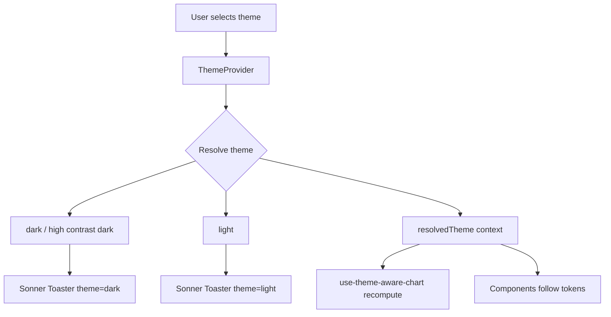

# Dark Mode & Theme Switching

## Purpose

Kala UI supports light, dark, and high-contrast themes through a `ThemeProvider` that exposes the *resolved* theme, not just the user's selection. This distinction matters: when a user picks a theme, the provider resolves it (e.g., respecting system preference or fallbacks) and publishes the result so every consumer — components, toasts, charts, app chrome — can render consistently. A key fix documented in the audit was that the Sonner `Toaster` stayed light even when a dark theme was active, because it keyed off the selected theme rather than the resolved one; it now maps `dark` and `high contrast dark` to Sonner's `dark` theme.

## Implementation map

- **ThemeProvider** — `packages/react/src/components/theme-provider/theme-provider.tsx` is the source of truth for theme state and `resolvedTheme`; tested in `theme-provider.test.tsx`.
- **Toast theme fix** — `packages/react/src/components/toast/toast.test.tsx` verifies toasts follow the active theme; `dark` and `high contrast dark` map to Sonner `dark`.
- **Hook-level scheme detection** — `packages/react-hooks/src/__tests__/use-color-scheme.test.ts` covers the hook that observes the OS color scheme, feeding resolved-theme awareness.
- **Uncontrolled/default value support** — `packages/react-hooks/src/__tests__/use-uncontrolled.test.ts` covers the default-value semantics used by theme selection controls (e.g., segmented control switching).
- **Theme-aware charts** — `packages/react-app/src/components/charts/theme-utils.ts` and `use-theme-aware-chart.ts` (with tests `theme-utils.test.ts`, `use-theme-aware-chart.test.ts`) recompute chart colors/config when the resolved theme changes.
- **Token system** — `packages/react/src/styles/tokens.test.ts` validates the CSS custom-property tokens that back  variants; see [Token-Driven Theming](features/token-driven-theming.md).
- **Audit record** — `docs/AUDIT-2026-08-27.md` documents the toast-follows-theme fix.
- **Storybook wiring** — `packages/react/.storybook/preview.tsx` applies theming in docs preview; see [Storybook Documentation](features/storybook-documentation.md).
- Consumers whose tests assert theme-aware rendering: `multi-select.tsx`, `tree-view.tsx` (`packages/react/src/components/`), `sidebar.tsx`, `data-table.tsx` (`packages/react-app/src/components/`).

Related pages: [Architecture](architecture.md) for the structural picture, [Core UI Component Library](features/core-ui-component-library.md) for the components that consume the theme, [Application Chrome Composites](features/application-chrome-composites.md) for themed app shell, and [Charts](features/charts.md) for theme-aware chart colors.

## Key flows

The `ThemeProvider` resolves the selected theme (using OS color-scheme detection when needed) and provides both `theme` and `resolvedTheme` via context. The Sonner `Toaster` and other components read `resolvedTheme` so their visuals match. Chart utilities subscribe via `use-theme-aware-chart` to re-derive colors when the resolved theme flips.

## Working notes

- When adding a themed component, read `resolvedTheme` from the provider rather than the raw selection — this is exactly the class of bug the toast fix addressed.
- Sonner mapping: only `dark` and `high contrast dark` map to Sonner `dark`; everything else stays light.
- Charts depend on `packages/react-app/src/components/charts/theme-utils.ts` for theme-derived colors — run its tests when touching theme resolution.
- Use `use-color-scheme` (packages/react-hooks) for OS-preference detection; `use-uncontrolled` backs default-value behavior in theme switches.
- Test commands live in [Testing strategy](testing.md) and [Getting started](getting-started.md); component-level theming tests are colocated as  next to each component.

## Evidence

| File | Role |
|---|---|
| `packages/react/src/components/theme-provider/theme-provider.tsx` | ThemeProvider with resolvedTheme |
| `packages/react/src/components/theme-provider/theme-provider.test.tsx` | Provider tests |
| `packages/react/src/components/toast/toast.test.tsx` | Toast follows active theme |
| `docs/AUDIT-2026-08-27.md` | Documents the Sonner toaster theme fix |
| `packages/react-hooks/src/__tests__/use-color-scheme.test.ts` | OS color-scheme hook tests |
| `packages/react-app/src/components/charts/use-theme-aware-chart.ts` | Theme-aware chart hook |
| `packages/react-app/src/components/charts/theme-utils.ts` | Theme color utilities for charts |
| `packages/react/src/styles/tokens.test.ts` | Theme token validation |
| `packages/react/.storybook/preview.tsx` | Storybook theme preview wiring |