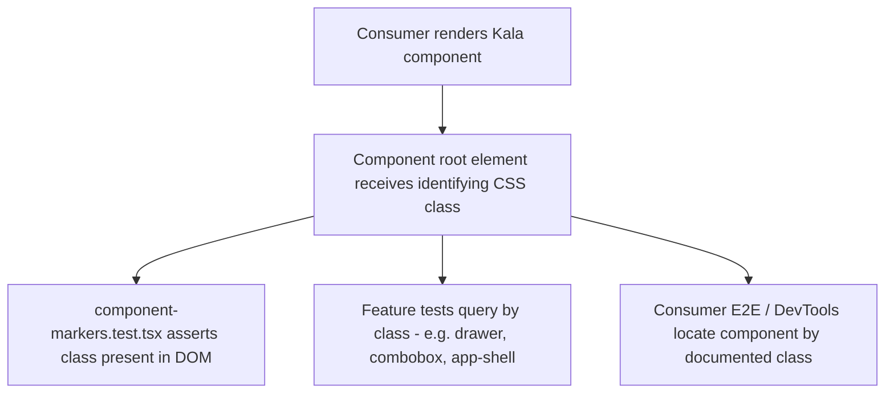

# DOM Component Identification

## Purpose

Kala UI components are identifiable in the rendered DOM via documented CSS class naming. Each component emits a stable class (e.g. `kui-…`-style markers on its root element) so consumers, E2E tests, and debugging tools can locate any Kala component without relying on implementation internals. The convention is enforced by a dedicated test suite (`component-markers.test.tsx`), meaning a component without a proper marker fails CI. This makes the library dependable for integration testing in consumer apps and aligns with the migration guidance in `docs/MIGRATION-0.1.md`.

## Implementation map

- **Marker convention tests** — `packages/react/src/__tests__/component-markers.test.tsx` is the canonical enforcement point: it renders components and asserts their identifying DOM classes.
- **Utility helpers** — `packages/react/src/__tests__/utils.test.ts` covers shared utilities (class merging / marker application) used across components.
- **Example emitting components** (source files that apply the identifying classes):
  - `packages/react/src/components/button-group/button-group.test.tsx`, `card/card.tsx`, `alert/alert.tsx`, `banner/banner-skeleton.test.tsx`, `card/card-skeleton.test.tsx`
  - `packages/react/src/components/drawer/drawer.tsx`, `toolbar/toolbar.test.tsx`, `segmented-control/segmented-control.tsx`, `progress/progress.tsx`
  - `packages/react/src/components/pagination/pagination.tsx`, `combobox/combobox.test.tsx`, `select/native-select.test.tsx`, `field/field.test.tsx`, `color-input/color-input.test.tsx`
  - `packages/react/src/components/error-boundary/error-boundary.tsx`, `list/list.test.tsx`, `table/table.test.tsx`, `burger/burger.tsx`
- **Design-system showcase helpers** — `packages/react/src/components/design-system/design-system-utils.ts` (with `design-system-utils.test.ts`) exposes component metadata/identification helpers used by `category-section.test.tsx`, `component-preview-card.test.tsx`, and `overview.test.tsx`.
- **App-side components** in `packages/react-app` follow the same convention: `app-shell/app-shell.tsx`, `dnd/dnd.tsx`, charts (`charts/theme-utils.test.ts`, `charts/use-theme-aware-chart.test.ts`, `chart.test.tsx`), `metric-card`, `session-card`, `footer` — including their skeleton variants.
- **Docs** — `docs/MIGRATION-0.1.md` documents the class-naming changes consumers must know about when upgrading; `packages/react/README.md` documents the identification convention for library users.
- **Build context** — `packages/react/tsup.config.ts` and `packages/react/scripts/flatten-dts.cjs` ship the package that carries these classes; tokens live in `packages/react/src/styles/tokens.test.ts` territory (see [Token-Driven Theming](features/token-driven-theming.md)).

Related pages: (the components that carry these classes), [React Hooks Collection](features/react-hooks-collection.md), [Architecture](architecture.md), [Testing strategy](testing.md).

## Key flows

When a consumer renders a Kala component, the component applies its identifying CSS class to its root element during render. Tests then query the DOM by that class to assert behavior, and skeletons/variants reuse the same base marker so loading states remain locatable.

## Working notes

- Adding a new component? It must appear in `packages/react/src/__tests__/component-markers.test.tsx` or the suite fails — treat that file as the registry of the convention.
- Skeleton variants (alert, banner, card, metric-card, session-card, chart) are tested separately; keep the base class on skeletons so selectors stay stable across loading states.
- Theme-aware app components (charts) couple markers with theme utilities; changing markers may ripple into `charts/theme-utils` and `use-theme-aware-chart` tests.
- Renaming any marker is a breaking change: update `docs/MIGRATION-0.1.md` and `packages/react/README.md` together, and run the react package test suite (see [Getting started](getting-started.md) for commands; validation details in [Testing strategy](testing.md)).
- Classes must not collide with Tailwind utilities; the token system ([Token-Driven Theming](features/token-driven-theming.md)) uses CSS custom properties on the same roots.

## Evidence

| File | Role |
|---|---|
| `packages/react/src/__tests__/component-markers.test.tsx` | Enforcement suite for DOM identification classes |
| `docs/MIGRATION-0.1.md` | Developer doc on class-naming migration |
| `packages/react/README.md` | Product doc describing identification convention |
| `packages/react/src/components/design-system/design-system-utils.ts` | Component metadata/identification helpers |
| `packages/react/src/components/card/card.tsx` | Example component applying identifying class |
| `packages/react-app/src/components/app-shell/app-shell.tsx` | App-side component with same convention |
| `packages/react/src/__tests__/utils.test.ts` | Shared class-utility tests |
| `packages/react/tsup.config.ts` | Package build carrying the classes |