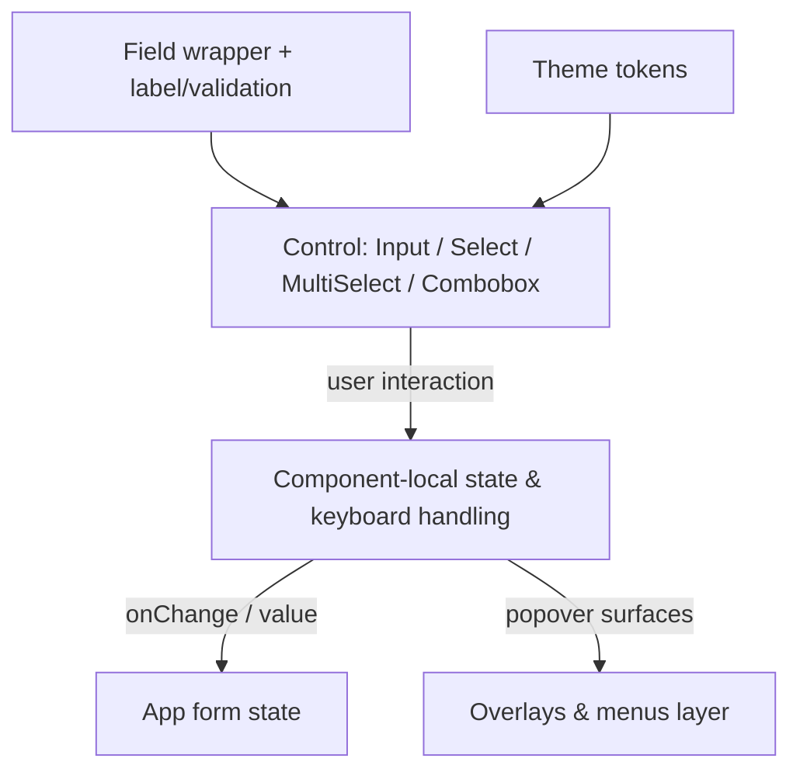

# Form Controls

## Purpose

The Form Controls suite is Kala UI's rich set of input primitives: text and number inputs, selects (native and custom), comboboxes, multi-select, checkboxes, radio groups, color and file inputs, date/calendar pickers, tag-input, OTP input, password-strength-indicator, and supporting field/indicator/form-skeleton scaffolding. These components are the primary way consumer apps collect user data, and they are styled via the token-driven theming system so they work in light, dark, and high-contrast themes without extra configuration.

## Implementation map

- **Text input**: `packages/react/src/components/input/input.tsx`, stories in `input.stories.tsx`, tested via `input.test.tsx`. Composition helper: `packages/react/src/components/input-group/input-group.stories.tsx`.
- **Number input**: `packages/react/src/components/number-input/number-input.tsx` (+ `number-input.test.tsx`).
- **Selects**: custom `packages/react/src/components/select/select.tsx` and native `packages/react/src/components/select/native-select.tsx`, each with colocated tests (`select.test.tsx`, `native-select.test.tsx`).
- **Combobox**: `packages/react/src/components/combobox/combobox.test.tsx` and `combobox-skeleton.test.tsx` (loading skeleton variant). Shares filter/keyboard behavior with the command palette — see [Overlays & Menus](features/overlays-menus.md).
- **Multi-select**: `packages/react/src/components/multi-select/multi-select.tsx`, `multi-select.types.ts`, and `multi-select-skeleton.tsx` (+ tests). Type contracts live in `multi-select.types.ts` — start there when extending options/filters.
- **Tag input**: `packages/react/src/components/tag-input/tag-input.tsx` (+ `tag-input.test.tsx`).
- **OTP input**: `packages/react/src/components/input-otp/input-otp.tsx` (+ `input-otp.test.tsx`).
- **Password strength**: `packages/react/src/components/password-strength-indicator/password-strength-indicator.tsx` .
- **Choice inputs**: `checkbox/checkbox.stories.tsx`, `radio-group/radio-group.test.tsx`.
- **Specialized inputs**: `color-input/color-input.tsx`, `file-upload/file-upload.tsx`, `calendar/calendar.test.tsx` (calendar underpins date picking).
- **Field scaffolding**: `field/field.test.tsx`, `field/form-skeleton.tsx` (+ `form-skeleton.test.tsx`), `indicator/indicator.tsx` (+ test) for validation/loading state affordances.
- **Consumers**: uses select/combobox-style filters in `column-filters.test.tsx`, `column-header-filter.test.tsx`, `data-table-toolbar.test.tsx`.

Related surfaces: overall structure in [Architecture](architecture.md), primitives used for layout in [Layout Primitives](features/layout-primitives.md), styling tokens in [Token-Driven Theming](features/token-driven-theming.md), DOM class conventions in [DOM Component Identification](features/dom-component-identification.md).

## Key flows

A typical form composes `Field` wrappers around individual controls; each control manages its own state/keyboard interaction and communicates values via standard React controlled-component patterns. Multi-select and combobox open popover surfaces (shared with [Overlays & Menus](features/overlays-menus.md)); tag-input manages a list of tags; password-strength-indicator derives a strength level from the current password value; input-otp captures one-time codes segment by segment.

## Working notes

- All form controls live under  with colocated , , and often  — follow that convention when adding a new control.
- Multi-select keeps its public types in `multi-select.types.ts`; import from there rather than restating shapes.
- Skeleton variants exist for combobox (`combobox-skeleton.test.tsx`), multi-select (`multi-select-skeleton.tsx`), and whole forms (`field/form-skeleton.tsx`) — use them for loading states.
- Styling must come from the CSS custom-property token system, not hardcoded colors, so dark/high-contrast themes keep working (see [Token-Driven Theming](features/token-driven-theming.md) and `packages/react/src/styles/tokens.test.ts`).
- Consult [Testing strategy](testing.md) for the test commands; each control has a colocated test file that is the fastest validation surface after changes.
- Calendar (`components/calendar`) backs date/time picking; check `calendar.test.tsx` for expected behavior before wiring a date picker.
- Verify new controls are identifiable in the DOM per the documented CSS class conventions ([DOM Component Identification](features/dom-component-identification.md)).

## Evidence

| Item | Reference |
|---|---|
| Input | packages/react/src/components/input/input.tsx |
| Select / NativeSelect | packages/react/src/components/select/select.tsx, native-select.tsx |
| MultiSelect | packages/react/src/components/multi-select/multi-select.tsx, multi-select.types.ts |
| Input OTP | packages/react/src/components/input-otp/input-otp.tsx |
| Password strength | packages/react/src/components/password-strength-indicator/password-strength-indicator.tsx |
| Tag input | packages/react/src/components/tag-input/tag-input.tsx |
| Field scaffolding | packages/react/src/components/field/form-skeleton.tsx, components/indicator/indicator.tsx |
| Theme tokens test | packages/react/src/styles/tokens.test.ts |
| Playground consumers | packages/react-app/src/components/data-table/column-filters.test.tsx, data-table-toolbar.test.tsx |