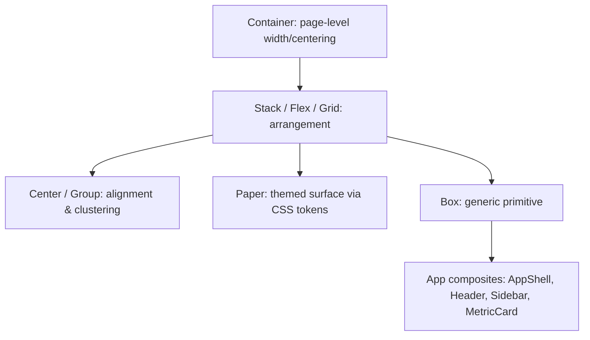

# Layout Primitives

## Purpose

Kala UI's layout primitives — `Box`, `Flex`, `Grid`, `Stack`, `Center`, `Container`, `Group`, and `Paper` — are the compositional backbone of the component library. They let consumers assemble page and component layouts from a small set of purpose-built wrappers instead of hand-rolled `
` soup, while remaining consistent with the token-driven theming system (see [Token-Driven Theming](features/token-driven-theming.md)). Status: shipped.

## Implementation map

- **Source area**: layout primitives live in the core React package, `packages/react/src/components/`, alongside other primitives. The only layout primitive with an explicitly evidenced test file is `Container`:
  - `packages/react/src/components/container/container.test.tsx` — unit tests for the `Container` component (centering, max-width behavior).
- **Composites built on top of layout primitives** (in `packages/react-app/src/components/`) demonstrate how  composition is used in practice: `app-shell`, `header`, `sidebar`, `navigation`, `metric-card`, `data-table` — see [Application Chrome Composites](features/application-chrome-composites.md).
- **Token integration**: `Paper` and other surfaced primitives consume CSS custom-property color tokens, tying into the whole-CSS-variable theme system described in [Token-Driven Theming](features/token-driven-theming.md).
- **DOM identification**: primitives are identifiable in the DOM via their documented CSS class naming (see [DOM Component Identification](features/dom-component-identification.md)).
- **Structural context**: how `packages/react` and `packages/react-app` fit together is covered in [Architecture](architecture.md).

## Key flows

A typical consumer composes a page as: `Container` provides horizontal centering and max-width; `Stack`/`Flex`/`Grid` arrange children vertically, row-wise, or on a grid; `Center` centers content; `Group` clusters inline controls; `Box` is the generic escape hatch; `Paper` adds a themed surface (background/border via tokens). Higher-level composites like `AppShell` in the react-app package build full application chrome from these same primitives.

## Working notes

- Layout primitives are consumed by nearly every other component family (cards, forms, navigation, data tables), so changes here have wide blast radius — check consumers in both `packages/react` and `packages/react-app` before changing props.
- `Container` has direct test coverage (`container/container.test.tsx`); run component tests via the pnpm test workflow described in [Getting started](getting-started.md) and [Testing strategy](testing.md).
- Keep primitives SSR-safe and React 19 / RSC-friendly (see [React Server Components Support](features/react-server-components-support.md)).
- Remember that Tailwind is not required to use Kala UI — styling rests on CSS custom-property tokens, so layout primitives should not assume a Tailwind runtime ([Token-Driven Theming](features/token-driven-theming.md)).

## Evidence

| Item | Path / note |
|---|---|
| Container test | `packages/react/src/components/container/container.test.tsx` |
| Core package source area | `packages/react/src/components/` |
| Composite consumers | `packages/react-app/src/components/` (app-shell, header, sidebar, navigation, metric-card, data-table) |
| Feature status | shipped |

## Related pages

- [Architecture](architecture.md) — overall source-area structure
- [Token-Driven Theming](features/token-driven-theming.md) — theming tokens used by `Paper` and others
- [Application Chrome Composites](features/application-chrome-composites.md) — composites built from layout primitives
- [Core UI Component Library](features/core-ui-component-library.md) — the wider primitive suite
- [Testing strategy](testing.md) — how component tests are run