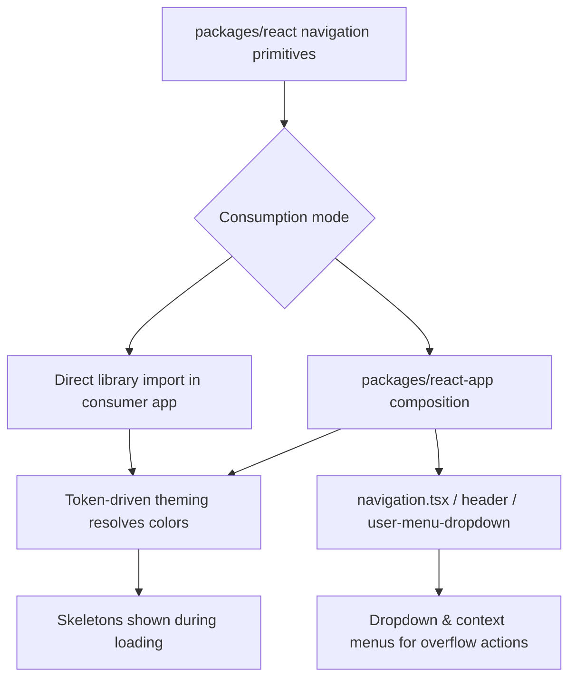

# Navigation Components

## Purpose

Kala UI's navigation components provide the primitives users need to move through an application hierarchy: breadcrumbs, navigation-menu, menubar, pagination, tabs, and tree-view. They live in the core library (`packages/react`), are built on the token-driven theming system so they follow  themes automatically, and are composed into real application chrome (header, sidebar, top navigation) in the playground app (`packages/react-app`). Their purpose is to give consumers accessible, theme-aware navigation without hand-rolling Radix-based wiring.

## Implementation map

- **Breadcrumbs** — `packages/react/src/components/breadcrumbs/breadcrumbs.tsx`, with public types in `breadcrumbs.types.ts` and a loading placeholder in `breadcrumbs-skeleton.tsx`. Tested via `breadcrumbs.test.tsx` and `__tests__/breadcrumbs.test.tsx`; usage examples in `breadcrumbs.stories.tsx`.
- **Navigation Menu** — `packages/react/src/components/navigation-menu/navigation-menu.tsx`, public exports via `navigation-menu/index.ts`, component metadata/config in `packages/react/src/config/navigation-menu.ts`, stories in `navigation-menu.stories.tsx`, tests in `navigation-menu.test.tsx`.
- **Menubar** — `packages/react/src/components/menubar/menubar.tsx`, tested in `menubar.test.tsx`.
- **Tree View** — `packages/react/src/components/tree-view/tree-view.tsx`, with stories (`tree-view.stories.tsx`) and tests (`tree-view.test.tsx`).
- **Related menu primitives** (frequently combined with navigation) — `packages/react/src/components/dropdown-menu/dropdown-menu.tsx` and `context-menu/context-menu.tsx` with their tests/stories; see [Overlays & Menus](features/overlays-menus.md).
- **App-level navigation composition** — `packages/react-app/src/components/navigation/navigation.tsx` and `navigation-skeleton.tsx` (with stories and tests) compose library primitives into app chrome; see [Application Chrome Composites](features/application-chrome-composites.md) and [Playground App](features/playground-app.md).
- **Header / user menu integration** — `packages/react-app/src/components/header/header.tsx` area (header tests, `header.stories.tsx`, `header-skeleton.test.tsx`) and `user-menu-dropdown.tsx` (with tests/stories) show dropdown-menu used for user navigation.
- **Docs** — `packages/react/README.md` (product docs) and `docs/MIGRATION-0.1.md` (breaking-change guidance for the 0.1 release).
- Structural context: [Architecture](architecture.md); theming contract: [Token-Driven Theming](features/token-driven-theming.md).

## Key flows

Consumers import a navigation primitive from `packages/react` (e.g. via `navigation-menu/index.ts`). The component resolves its styling from CSS custom-property tokens, so it renders correctly under whichever theme is active (see [Dark Mode & Theme Switching](features/dark-mode-theme-switching.md)). In the playground app, `navigation.tsx` and the header compose these primitives with dropdown/context menus to form the app shell; skeletons (`breadcrumbs-skeleton.tsx`, `navigation-skeleton.tsx`) render while navigation data loads.

## Working notes

- Each primitive ships colocated tests  — run the suite per [Testing strategy](testing.md) before touching implementation files; e.g. `pnpm test` from the repo root (see [Getting started](getting-started.md)).
- Breadcrumbs has two test files (`breadcrumbs.test.tsx` and `__tests__/breadcrumbs.test.tsx`) — check both when changing its API; public props are defined in `breadcrumbs.types.ts`.
- Navigation-menu has a dedicated config file (`packages/react/src/config/navigation-menu.ts`) used by the design-system catalog (`design-system-utils.ts`), so component metadata changes may affect design-system tests (`design-system-utils.test.ts`, `overview.test.tsx`).
- Stories files (`breadcrumbs.stories.tsx`, `navigation-menu.stories.tsx`, `tree-view.stories.tsx`) double as usage documentation — see [Storybook Documentation](features/storybook-documentation.md).
- DOM classes on these components follow the documented naming convention in [DOM Component Identification](features/dom-component-identification.md), which tests may rely on for identification.
- Consult `docs/MIGRATION-0.1.md` before renaming exports; consumers migrate via that guide.
- Pagination and tabs are part of this scope but their implementation files were not among the supplied evidence — locate them under `packages/react/src/components/` before editing rather than assuming.

## Evidence

| Artifact | Role |
|---|---|
| `packages/react/src/components/breadcrumbs/breadcrumbs.tsx` | Breadcrumbs implementation |
| `packages/react/src/components/navigation-menu/navigation-menu.tsx` (+ `index.ts`, `config/navigation-menu.ts`) | Navigation menu implementation/exports/config |
| `packages/react/src/components/menubar/menubar.tsx` | Menubar implementation |
| `packages/react/src/components/tree-view/tree-view.tsx` | Tree view implementation |
| `packages/react-app/src/components/navigation/navigation.tsx` | App-level navigation composition |
| `packages/react-app/src/components/user-menu-dropdown/user-menu-dropdown.tsx` | Dropdown-based user navigation |
| `docs/MIGRATION-0.1.md` | Breaking-change/migration guidance |
| `packages/react/README.md` | Library product docs |