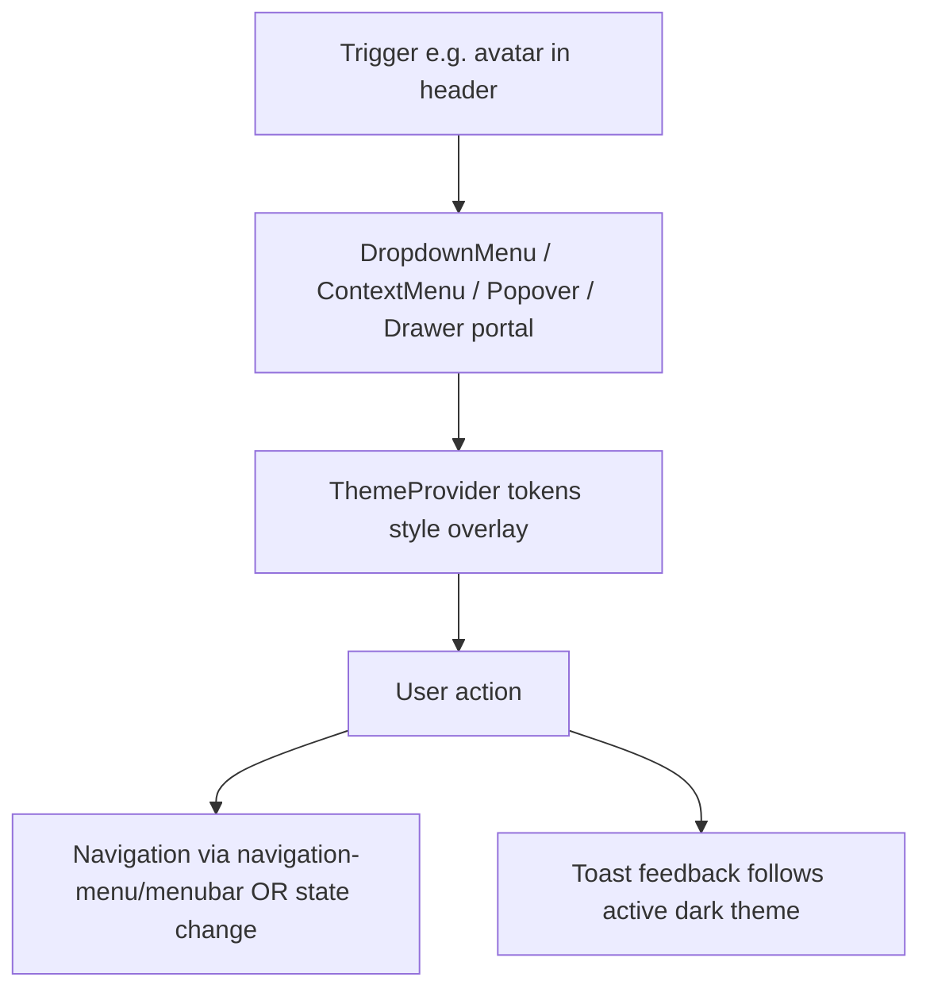

# Overlays & Menus

## Purpose

Kala UI's overlay layer covers every floating and portal-rendered surface in the library: dialogs, drawers, popovers, tooltips, dropdown and context menus, a command palette, and toasts. These components are built on Radix UI primitives and styled with the token system, so overlays automatically follow the active  theme. They are the primary interaction surface for menus and modal flows in consumer apps and in the playground app's application chrome (e.g. the user menu dropdown in the header).

## Implementation map

- **Context menu** — `packages/react/src/components/context-menu/context-menu.tsx`, barrel `index.ts`, stories and tests in the same folder (`context-menu.stories.tsx`, `context-menu.test.tsx`).
- **Dropdown menu** — `packages/react/src/components/dropdown-menu/dropdown-menu.tsx` with `dropdown-menu.stories.tsx` and `dropdown-menu.test.tsx`.
- **Command palette** — `packages/react/src/components/command/command.tsx` (runtime surface), exercised via `command.stories.tsx` and `command.test.tsx`.
- **Drawer** — `packages/react/src/components/drawer/drawer.tsx`.
- **Popover** — `packages/react/src/components/popover/popover.tsx`.
- **Related menu/navigation primitives** — `menubar`, `navigation-menu` (with shared config in `packages/react/src/config/navigation-menu.ts`), `tabs`, `toggle-group`, `accordion` under `packages/react/src/components/`; see [Navigation Components](features/navigation-components.md).
- **Playground composition** — `packages/react-app/src/components/user-menu-dropdown/user-menu-dropdown.tsx` builds a real dropdown menu over an avatar (`packages/react/src/components/avatar/avatar.tsx`), tested in `user-menu-dropdown.test.tsx` and `__tests__/user-menu-dropdown.test.tsx`, embedded in `app-shell.tsx` / `header.stories.tsx`.
- **Theming interplay** — overlays inherit theme via `packages/react/src/components/theme-provider/theme-provider.tsx`; see [Dark Mode & Theme Switching](features/dark-mode-theme-switching.md) and [Token-Driven Theming](features/token-driven-theming.md).
- **Migration contracts** — `docs/MIGRATION-0.1.md` documents 0.1 changes affecting these components.
- Library-wide context: [Architecture](architecture.md); component inventory: [Core UI Component Library](features/core-ui-component-library.md).

## Key flows

A typical overlay lifecycle: the consumer renders a trigger (e.g. an avatar in the playground header), a Radix-based menu or dialog opens in a portal positioned relative to the trigger, content is styled from CSS custom-property tokens resolved by the ThemeProvider, and selection either navigates (navigation-menu, menubar) or mutates local state (dropdown/context menu, command palette). For the playground, `user-menu-dropdown.tsx` composes the library dropdown-menu with the avatar component inside the app-shell header, with skeleton states covered by `header-skeleton.test.tsx`.

## Working notes

- All overlay components live in `packages/react` and export via per-component barrels (e.g. `context-menu/index.ts`); keep new exports consistent with that pattern.
- Tests are colocated  and stories  double as interactive docs — see [Storybook Documentation](features/storybook-documentation.md) and run commands from [Getting started](getting-started.md) / [Testing strategy](testing.md).
- `command.stories.tsx` is flagged as a runtime surface: use it to exercise the command palette end-to-end, not just visually.
- When changing menu APIs, check `docs/MIGRATION-0.1.md` and `packages/react-app/CHANGELOG.md` for breaking-change precedent before shipping.
- Ensure any new overlay respects the resolved dark theme — the toast/dark-theme regression documented in [Dark Mode & Theme Switching](features/dark-mode-theme-switching.md) is the known failure mode.
- DOM-visible classes follow the documented naming convention in [DOM Component Identification](features/dom-component-identification.md); overlays should remain identifiable in the DOM.

## Evidence

| Artifact | Role |
|---|---|
| `packages/react/src/components/context-menu/context-menu.tsx` | Context menu implementation |
| `packages/react/src/components/dropdown-menu/dropdown-menu.tsx` | Dropdown menu implementation |
| `packages/react/src/components/command/command.tsx` | Command palette runtime surface |
| `packages/react/src/components/drawer/drawer.tsx` | Drawer overlay |
| `packages/react/src/components/popover/popover.tsx` | Popover overlay |
| `packages/react-app/src/components/user-menu-dropdown/user-menu-dropdown.tsx` | Playground composition of dropdown + avatar |
| `packages/react/src/components/theme-provider/theme-provider.tsx` | Theme resolution for overlays |
| `packages/react/src/config/navigation-menu.ts` | Shared navigation-menu config |
| `docs/MIGRATION-0.1.md` | 0.1 breaking-change contracts |
| `packages/react/src/components/command/command.test.tsx` | Command palette tests |