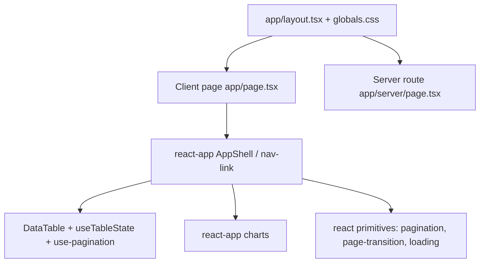

# Playground App

## Purpose

The Playground App is a Next.js application (`apps/playground`) that exercises the Kala UI library in a real app runtime — both client and server routes. It exists to validate that library components (AppShell, DataTable, charts, pagination, navigation, page transitions, loading states) work end-to-end in Next.js with React, Tailwind, and the token-driven theme system. It complements Storybook by proving components behave in App Router layouts, server-rendered pages, and client interactivity.

## Implementation map

- **Playground app shell**: `apps/playground/app/layout.tsx`, `apps/playground/app/page.tsx`, `apps/playground/app/server/page.tsx`, `apps/playground/app/globals.css`, `apps/playground/next.config.ts`, `apps/playground/package.json`, `apps/playground/tsconfig.json`. `app/page.tsx` is the client entry; `app/server/page.tsx` is the server-route exercise.
- **App-level composites**: `packages/react-app` provides heavier building blocks the playground composes — `src/components/app-shell/app-shell.tsx` (+ `index.ts`), navigation (`navigation.test.tsx`), `nav-link`, charts (`charts/area-chart.tsx`, `charts/bar-chart.tsx`, `theme-utils`), and `data-table` (`data-table.tsx`, `useTableState.ts`, `pagination-nav`). See `wiki:features/application-chrome-composites.md`, `wiki:features/charts.md`, and `wiki:features/core-ui-component-library.md`.
- **Consumed library packages**: `packages/react` supplies primitives rendered in the playground — page transitions (`page-transition.tsx`, `page-transition.types.ts`), pagination, breadcrumbs, loading (`loading/page-loader.tsx`); `packages/react-hooks` supplies `use-pagination` and `use-scroll-lock`. See `wiki:features/react-hooks-collection.md`.
- **Tooling scripts**: `scripts/check-package-boundaries.mjs` enforces which packages the playground may import; `scripts/test-storybook.mjs` and `scripts/clean.mjs` support verification workflows (see `wiki:getting-started.md`).
- **Docs**: `docs/AUDIT-2026-08-27.md`, `docs/MIGRATION-0.1.md`, `packages/react-app/README.md`, `packages/react-app/CHANGELOG.md` record component status and v0.1 migration guidance.

## Key flows

Booting the playground renders the shared `layout.tsx` (globals.css wires theme tokens) and mounts the client page; navigating to `/server` exercises a server-rendered route. Composite components from `packages/react-app` (AppShell, DataTable with `useTableState` + `use-pagination`, charts) wrap primitives from `packages/react`.

## Working notes

- Run commands via pnpm; see `wiki:getting-started.md` for dev/build/test invocations.
- Import direction is enforced: playground consumes `packages/react-app`, `packages/react`, `packages/react-hooks` — never the reverse. `scripts/check-package-boundaries.mjs` guards this; run it before adding cross-package imports.
- Tests colocated with components: `app-shell.test.tsx`, `data-table.test.tsx` / `useTableState.test.ts` / `pagination-nav.test.tsx`, chart tests, plus `packages/react-app/src/__tests__/a11y.test.tsx` for accessibility coverage. Primitives have their own suites (`pagination.test.tsx`, `page-transition.test.tsx`, `breadcrumbs.test.tsx`, `loading.test.tsx`).
- Stories live next to sources (`app-shell.stories.tsx`, `data-table.stories.tsx`, `loading.stories.tsx`); interactive verification uses Storybook (see `wiki:features/storybook-documentation.md`) via `scripts/test-storybook.mjs`.
- When adding new playground routes, register them under `apps/playground/app/` and keep theme token wiring in `globals.css` consistent with `wiki:features/token-driven-theming.md`.
- Server-route changes should be validated against RSC constraints described in `wiki:features/react-server-components-support.md`.

## Evidence

| Artifact | Role |
| --- | --- |
| `apps/playground/app/layout.tsx`, `app/page.tsx`, `app/server/page.tsx` | App shell, client page, server route |
| `apps/playground/next.config.ts`, `package.json`, `tsconfig.json`, `app/globals.css` | Config and theme tokens |
| `packages/react-app/src/components/app-shell/app-shell.tsx` | App chrome composite |
| `packages/react-app/src/components/data-table/data-table.tsx`, `useTableState.ts` | DataTable state and pagination-nav |
| `packages/react-hooks/src/use-pagination/use-pagination.ts` | Pagination hook powering tables |
| `packages/react/src/components/page-transition/page-transition.tsx` | Route transition primitive |
| `scripts/check-package-boundaries.mjs` | Import-boundary enforcement |
| `docs/AUDIT-2026-08-27.md`, `docs/MIGRATION-0.1.md`, `packages/react-app/README.md` | Audit, migration, package docs |