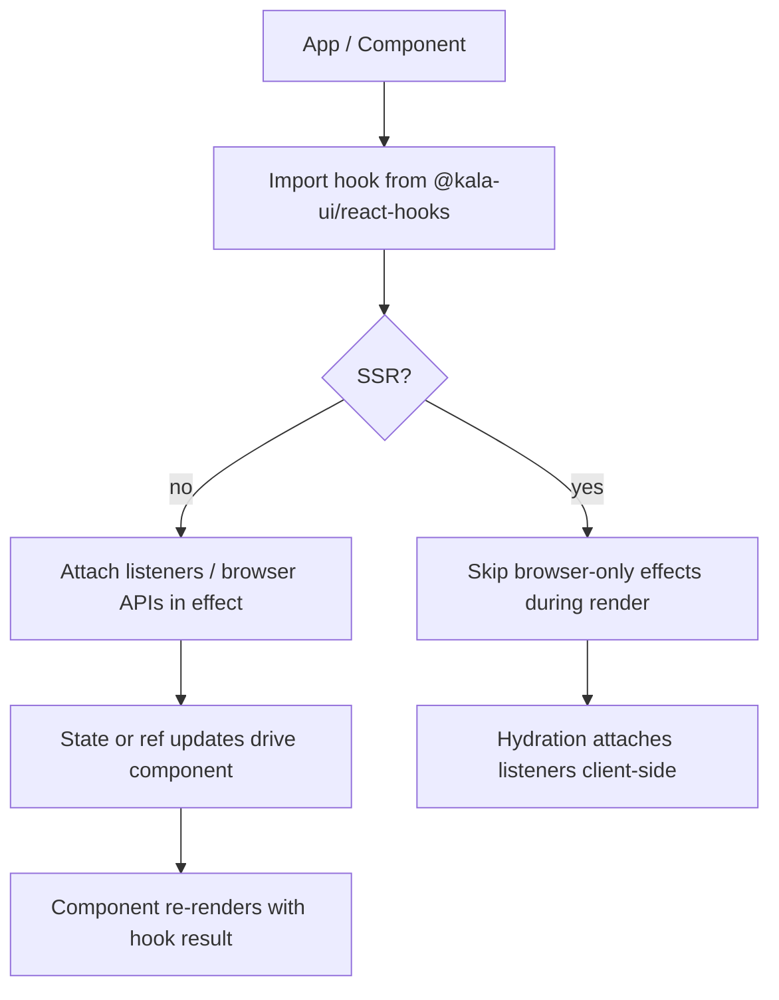

# React Hooks Collection

## Purpose

The `@kala-ui/react-hooks` package (in `packages/react-hooks`) provides 37 reusable React hooks for building modern web applications. The collection is SSR-safe (safe to render on the server, e.g. inside the Next.js playground) and typed for React 19. Hooks cover four broad areas:

- **State**: `use-counter`, `use-disclosure`, `use-list-state`, `use-previous`, `use-id`, `use-pagination`
- **Debounce/timing**: `use-debounce`, `use-debounced-value`, `use-interval`, `use-timeout`, `use-idle`
- **DOM**: `use-click-outside`, `use-focus-trap`, `use-hotkeys`, `use-hover`, `use-element-size`, `use-intersection`, `use-media-query`, `use-mouse`, `use-move`, `use-merged-ref`, `use-mounted`, `use-scroll-lock`, `use-reduced-motion`
- **Browser APIs**: `use-clipboard`, `use-local-storage`, `use-network`, `use-os`, `use-color-scheme`, `use-document-title`, `use-isomorphic-effect`

The hooks package complements the component library in `packages/react` (see `wiki:features/core-ui-component-library.md`) by supplying headless behavior primitives that components and apps compose.

## Implementation map

- `packages/react-hooks/` — the hooks package itself; each hook lives under  (e.g. `src/use-id/use-id.ts`), with a flat test suite in `src/__tests__/` (one test file per hook, listed above).
- `packages/react-hooks/package.json` — package manifest for the published hooks package.
- `packages/react-hooks/README.md` — product documentation for the collection; `EXAMPLES.md` — developer-facing usage examples.
- `packages/react-hooks/CHANGELOG.md` — release history for the hooks package.
- `packages/react-hooks/biome.json` — lint/format config used across the package.
- `packages/react-hooks/src/__tests__/setup.ts` — shared test setup (browser-API stubs needed for SSR-safe hooks under Vitest/jsdom).
- `packages/react` — component library that consumes hook behavior (e.g. `use-focus-trap`, `use-disclosure` patterns in overlays; see `wiki:features/overlays-menus.md`), with tests like `src/components/spoiler/spoiler.test.tsx`, `error-boundary`, `rating`, and `tree-view`.
- `packages/react-app` — app-level package (charts `src/components/charts/chart.tsx` and `metric-card`) that builds on both `react` and `react-hooks`; see `wiki:features/playground-app.md`.
- `docs/MIGRATION-0.1.md`, `docs/AUDIT-2026-08-27.md` — developer docs covering package structure and audit findings relevant to the hooks package (see `wiki:architecture.md`).

## Key flows

A typical consumer imports a hook from the package and wires it into a component. SSR-safety is achieved via `use-isomorphic-effect`-style guards: browser-only work (clipboard, network, media queries, mouse listeners) runs in effects rather than during render, so server rendering (Next.js) doesn't touch `window`/`document`.

Hooks like `use-local-storage` and `use-color-scheme` persist/read state across reloads; `use-hotkeys`, `use-focus-trap`, and `use-scroll-lock` are the behavioral backbone for keyboard interaction and overlays.

## Working notes

- **Add a new hook**: create , export from the package entry, and add a matching test in `src/__tests__/`. Every existing hook follows this one-hook-one-file pattern.
- **SSR-safety is a contract**: never read `window`, `document`, or `navigator` during render; do it inside effects (the `use-isomorphic-effect` test pins this pattern). The Next.js playground exercises server rendering paths.
- **React 19 typing**: hooks are typed against React 19; avoid deprecated APIs when extending.
- **Testing**: run the package's Vitest suite from the repo root or package dir (`pnpm` workspace). `src/__tests__/setup.ts` supplies the shared environment; jsdom-sensitive hooks (`use-clipboard`, `use-network`, `use-media-query`) rely on it.
- **Lint**: `biome.json` governs formatting; run the repo's lint scripts before submitting changes (see `wiki:getting-started.md`).
- Related context: `wiki:features/core-ui-component-library.md` (components consuming hook behavior), `wiki:features/react-server-components-support.md` (SSR/RSC constraints), `wiki:testing.md` (validation strategy), `wiki:architecture.md` (how `packages/react-hooks` fits the package layout).

## Evidence

| Artifact | Role |
|---|---|
| `packages/react-hooks/src/use-id/use-id.ts` | Representative hook implementation |
|  | Per-hook test suites (all 37 hooks covered) |
| `packages/react-hooks/src/__tests__/setup.ts` | Shared test environment/setup |
| `packages/react-hooks/README.md` | Product docs for the hooks collection |
| `packages/react-hooks/EXAMPLES.md` | Usage examples |
| `packages/react-hooks/package.json`, `biome.json` | Package manifest and lint config |
| `packages/react-hooks/CHANGELOG.md` | Release history |
| `docs/MIGRATION-0.1.md`, `docs/AUDIT-2026-08-27.md` | Migration notes and audit findings |