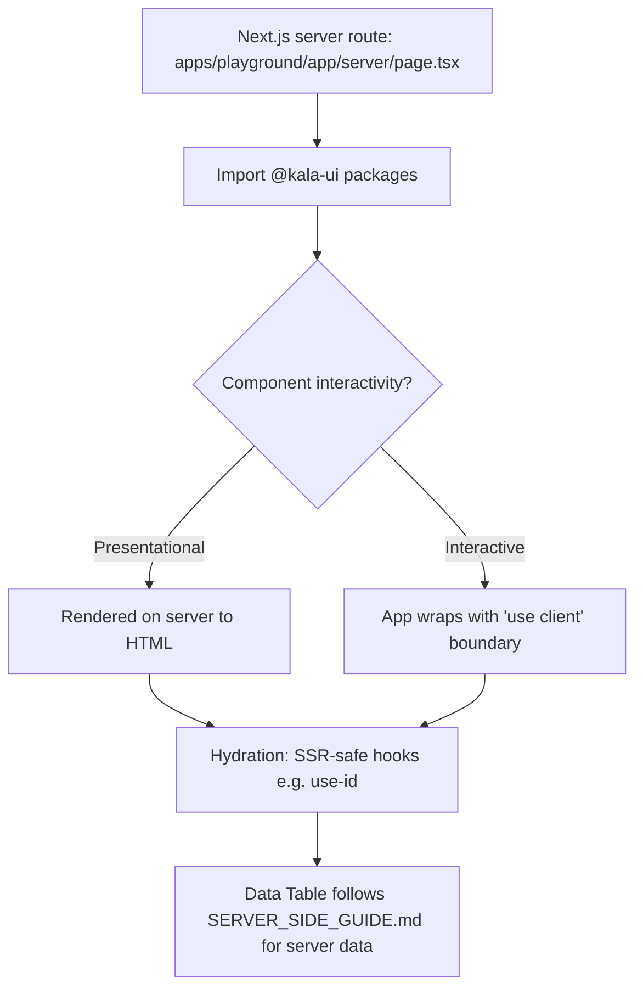

# React Server Components Support

## Purpose

Kala UI's `packages/react` core library is built for React 19 and is safe to import and render inside React Server Components (RSC). Server-compatible components avoid React  APIs at the top level, so they can render on the server in Next.js apps (the playground exercises this at `apps/playground/app/server/page.tsx`) while interactive components remain client-isolated by the consuming app. This matters because the library ships as source-consumable packages (`react`, `react-app`, `react-hooks`) built with tsup, and consumers need confidence that importing from them in a server component won't break the build or leak browser APIs.

## Implementation map

- **Core server-safe component suite — `packages/react`**: presentational and lightly interactive components with tests that render without a client environment, e.g. `tabs`, `toggle`, `button-group`, `progress`, `list`, `table`, `rating`, `spoiler`, `popover`, `scroll-area`, `tree-view`, `error-boundary`, `resizable`, and `navigation-menu` (see the respective  files under `packages/react/src/components/`). Client directives ("use client") are the consumer's responsibility; see [Core UI Component Library](features/core-ui-component-library.md) for the full inventory.
- **Type flattening for package exports — `packages/react/scripts/flatten-dts.cjs` and `packages/react/tsup.config.ts`**: build tooling that produces flattened declaration output so the published package exposes clean, server-importable types.
- **Server-verified runtime surface — `apps/playground/app/server/page.tsx`**: a server route in the Next.js playground that exercises library components from a server component; the living proof of RSC readiness. See [Playground App](features/playground-app.md).
- **SSR-safe identity hook — `packages/react-hooks/src/use-id/use-id.ts`**: hook collection documented as SSR-safe (see `packages/react/README.md`), relevant when hydration must match server output; see [React Hooks Collection](features/react-hooks-collection.md).
- **Server-side data patterns — `packages/react-app/src/components/data-table/SERVER_SIDE_GUIDE.md` and `useTableState.test.ts`**: documents how `Data Table` integrates with server-side data fetching/state in RSC-style apps.
- **Composite app components — and `charts/*`**: AppShell and chart components (`chart.tsx`, `area-chart.tsx`, `bar-chart.tsx`, `donut-chart.tsx`, `chart-skeleton.tsx`, `chart.types.ts`) with colocated tests and stories; see [Application Chrome Composites](features/application-chrome-composites.md) and [Charts](features/charts.md).
- **Design-system utilities — `packages/react/src/components/design-system/design-system-utils.ts`**: pure helpers (tested in `design-system-utils.test.ts`) safe for server rendering of docs/showcase trees (`category-section.test.tsx`).
- **Migration and audit docs — `docs/MIGRATION-0.1.md`, `docs/AUDIT-2026-08-27.md`**: developer docs covering the 0.1 packaging/migration story that established RSC-ready distribution; see [Architecture](architecture.md).
- **Validation scripts — `scripts/test-storybook.mjs`**: cross-package Storybook test runner used alongside unit tests; see [Storybook Documentation](features/storybook-documentation.md) and [Testing strategy](testing.md).

## Key flows

A typical RSC render in a Next.js app imports from `@kala-ui/react` (or sibling packages) inside a server component. Pure/presentational components (tables, lists, progress, layout primitives) render to HTML directly; interactive ones are wrapped by the app with a `"use client"` boundary. Identity/SSR-sensitive hooks from `@kala-ui/react-hooks` (e.g. `use-id`) keep server and client output aligned during hydration. The playground's server route demonstrates this end to end, and Data Table consumers follow `SERVER_SIDE_GUIDE.md` for server-fetched data.

## Working notes

- Do not assume a component is client-only just because it's interactive; tests for `tabs`, `toggle`, `popover`, etc. render in a plain test environment (no browser), which is a good signal of server-safety.
- When adding new components, avoid top-level browser API access and keep side effects inside effects so the component remains RSC-importable; mirror the colocated  pattern.
- Package type output is post-processed by `packages/react/scripts/flatten-dts.cjs` (wired through `packages/react/tsup.config.ts`) — changes to exports should keep flattened declarations valid.
- Validate with unit tests plus `scripts/test-storybook.mjs`; commands are documented in [Getting started](getting-started.md) and [Testing strategy](testing.md).
- For Data Table in server-rendered apps, read `packages/react-app/src/components/data-table/SERVER_SIDE_GUIDE.md` before wiring data fetching or `useTableState`.

## Evidence

| Artifact | Role |
|---|---|
| apps/playground/app/server/page.tsx | Server-component runtime surface proving RSC usage |
| packages/react/README.md | Documents React 19 / RSC readiness of core library |
| packages/react-hooks/src/use-id/use-id.ts | SSR-safe identity hook for hydration parity |
| packages/react-hooks/README.md | SSR-safe hooks documentation |
| packages/react-app/src/components/data-table/SERVER_SIDE_GUIDE.md | Server-side Data Table integration guide |
| packages/react/tsup.config.ts, packages/react/scripts/flatten-dts.cjs | Package build/type flattening for clean imports |
| docs/MIGRATION-0.1.md, docs/AUDIT-2026-08-27.md | Migration/audit context for RSC-ready packaging |
| packages/react/src/components/*/\*.test.tsx | Server-environment renderability signal (tabs, toggle, list, table, etc.) |
| packages/react-app/src/components/charts/\*.tsx | Composite chart components with tests/stories |
| scripts/test-storybook.mjs | Cross-package validation runner |