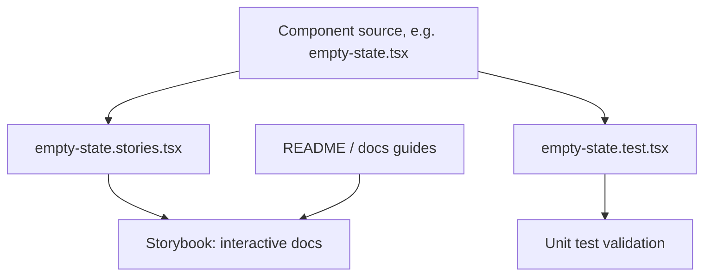

# Storybook Documentation

## Purpose

Kala UI ships interactive component documentation through Storybook: co-located  files next to component sources provide live, interactive examples of library components, plus a verification surface beyond unit tests. Storybook stories act as living documentation for consumers evaluating components in isolation, complementing the README-level docs (`README.md`, `packages/react/README.md`) and developer docs in `docs/`.

## Implementation map

- **Story files live beside their components**
  - `packages/react-app/src/components/data-table/data-table.stories.tsx` — stories for the Data Table composite, exercising `useTableState.ts` and `data-table.types.ts` contracts.
  - `packages/react-app/src/components/dnd/dnd.stories.tsx` — drag-and-drop interaction stories.
  - `packages/react/src/components/empty-state/empty-state.stories.tsx` — Empty State stories in the core `@kala-ui/react` package; its variants are also covered by `empty-state.test.tsx` and `empty-state-skeleton.test.tsx`.
- **Storybook interacts with three packages**
  - `packages/react` — core component library (see `wiki:features/core-ui-component-library.md`).
  - `packages/react-hooks` — hooks collection, tested in `packages/react-hooks/src/__tests__/` (see `wiki:features/react-hooks-collection.md`).
  - `packages/react-app` — playground/React app package hosting composite components like Data Table and charts (`theme-utils.ts`) (see `wiki:features/playground-app.md` and `wiki:features/charts.md`).
- **Documentation surfaces referenced alongside Storybook**
  - `README.md`, `packages/react/README.md`, `packages/react/CHANGELOG.md` — product docs and release history.
  - `docs/AUDIT-2026-08-27.md`, `docs/MIGRATION-0.1.md` — developer docs covering audit state and migration guidance.
- Related structural context: `wiki:architecture.md`; overall capabilities: `wiki:README.md`.

## Key flows

A contributor documents a component by writing a  file in the same directory as the component implementation. Each story renders a real component instance with representative props; complex components like Data Table wire up stateful logic (`useTableState.ts`) so stories reflect actual runtime behavior. Unit tests (e.g., `data-table.test.tsx`, `empty-state.test.tsx`) cover behavior, while stories cover visual/interactive documentation.

## Working notes

- Follow the existing convention: place  next to the component's source files, not in a separate stories directory.
- When documenting stateful composites, drive the story through the same hooks/types used in production code (`useTableState.ts`, `data-table.types.ts`) so documentation stays truthful to real contracts.
- Pair new stories with new/updated  tests — the repo consistently has both per component.
- Themed components (charts via `theme-utils.ts`) should include stories that reflect token-driven theming behavior; see `wiki:features/token-driven-theming.md` and `wiki:features/dark-mode-theme-switching.md`.
- Run/test commands are documented in `wiki:getting-started.md` and `wiki:testing.md` (pnpm-based).
- Migration and audit notes in `docs/MIGRATION-0.1.md` and `docs/AUDIT-2026-08-27.md` may flag components whose docs/stories need updating.

## Evidence

| File | Role |
|---|---|
| `packages/react/src/components/empty-state/empty-state.stories.tsx` | Story file in core react package |
| `packages/react-app/src/components/data-table/data-table.stories.tsx` | Data Table stories |
| `packages/react-app/src/components/dnd/dnd.stories.tsx` | Drag-and-drop stories |
| `packages/react/src/components/empty-state/empty-state.test.tsx` | Companion unit test example |
| `packages/react-app/src/components/data-table/useTableState.ts` | State logic exercised by stories |
| `README.md`, `packages/react/README.md` | Product docs |
| `docs/AUDIT-2026-08-27.md`, `docs/MIGRATION-0.1.md` | Developer docs |