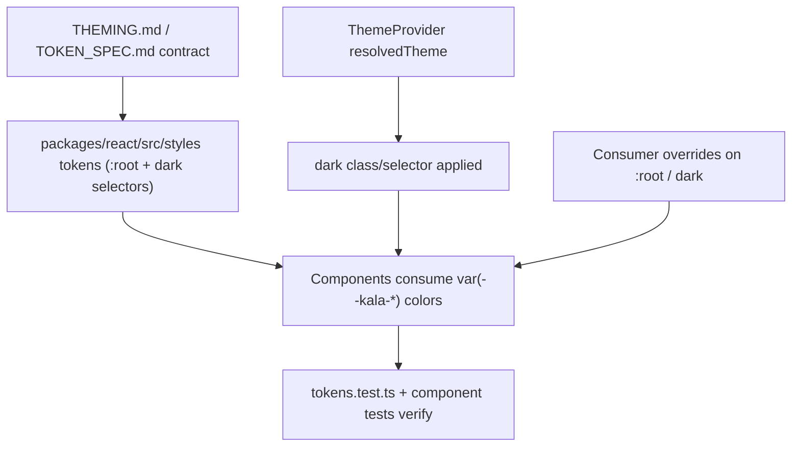

# Token-Driven Theming

## Purpose

Kala UI's theming system is built on whole-CSS-color custom properties ("tokens"). Every component reads its colors from these variables, so the library ships coherent light, dark, and high-contrast themes and lets consumers override any token by redefining it on `:root` (and the `dark` selector for dark mode). A key property of this design: **you do not need Tailwind to use Kala UI** — the tokens are plain CSS custom properties, not Tailwind theme extensions, so any stack (Vite, Next.js, plain CSS) can consume them. This is the backbone that Dark Mode & Theme Switching ([Dark Mode & Theme Switching](features/dark-mode-theme-switching.md)) and DOM Component Identification ([DOM Component Identification](features/dom-component-identification.md)) build on.

## Implementation map

- **Token definitions & contract** — `packages/react/src/styles/` holds the token custom properties; `packages/react/TOKEN_SPEC.md` is the developer-facing specification of every token, its  values, and override rules. `THEMING.md` at the repo root documents how consumers override tokens on `:root` and `dark` selectors.
- **Token verification tests** — `packages/react/src/styles/tokens.test.ts` locks the token set and theme values, preventing accidental removal/renaming of custom properties.
- **Component conformance** — component tests that assert theming/behavior per component: `button/button.test.tsx`, `input/input.test.tsx`, `tabs/tabs.test.tsx`, `toast/toast.test.tsx`, `heading/heading.test.tsx`, `resizable/resizable.test.tsx`, `empty-state/empty-state.test.tsx`, `error-boundary/error-fallback.test.tsx` (all under `packages/react/src/components/`).
- **Marker system (DOM identification)** — `scripts/add-kala-markers.mjs` and `packages/react/src/__tests__/component-markers.test.tsx` attach/verify the CSS classes documented in [DOM Component Identification](features/dom-component-identification.md); markers coexist with token-based styling.
- **Consumer-side theme usage** — `packages/react-app/src/components/charts/theme-utils.test.ts` shows how the playground app derives chart theme from the active Kala theme; `session-card/session-card.test.tsx` verifies composite components render correctly under theming. See [Playground App](features/playground-app.md) and [Charts](features/charts.md).
- **Docs & history** — `docs/AUDIT-2026-08-27.md` and `docs/MIGRATION-0.1.md` record the theming audit and breaking changes for the 0.1 release; `README.md` and `packages/react/README.md` document the "no Tailwind required" positioning. Structural context: [Architecture](architecture.md); setup: [Getting started](getting-started.md).

## Key flows

At runtime, components reference CSS custom properties (`var(--kala-…)`) resolved from styles emitted by `packages/react`. `:root` defines light theme values; a `dark` selector (driven by ThemeProvider's resolved theme, see [Dark Mode & Theme Switching](features/dark-mode-theme-switching.md)) redefines them for dark/high-contrast-dark. Consumers can override individual tokens by re-declaring the custom property — no Tailwind config or rebuild required.

## Working notes

- Treat `TOKEN_SPEC.md` as the source of truth for token names; update it in the same change as token edits, and keep `packages/react/src/styles/tokens.test.ts` green (run the test suite per [Testing strategy](testing.md)).
- High-contrast themes are expressed via the same custom properties on the `dark` selector — when adding a component, define its colors only through tokens, never hard-coded colors, or dark/high-contrast modes will break.
- Overriding tokens does not require Tailwind or any build step — the audience includes plain-CSS and Vite consumers (project supports next, react, vite).
- `toast.test.tsx` is the regression point for the fixed bug where Sonner toasts stayed light under dark themes — keep toast theme mapping covered when touching theming.
- `theme-utils.test.ts` in `packages/react-app` guards chart theming derived from the active theme; update it if chart token mapping changes.
- Ignore `storybook-static/` artifacts (e.g., `theming-BgT2grXK.js`) — build output, not source.

## Evidence

| File | Role |
|---|---|
| THEMING.md | Theming/override documentation (root) |
| packages/react/TOKEN_SPEC.md | Token specification |
| packages/react/src/styles/tokens.test.ts | Token contract tests |
| docs/MIGRATION-0.1.md | 0.1 breaking-change/migration notes |
| docs/AUDIT-2026-08-27.md | Theming audit record |
| packages/react/src/components/toast/toast.test.tsx | Dark-theme toast regression test |
| packages/react-app/src/components/charts/theme-utils.test.ts | Chart theme derivation tests |
| scripts/add-kala-markers.mjs | Component CSS-class marker script |