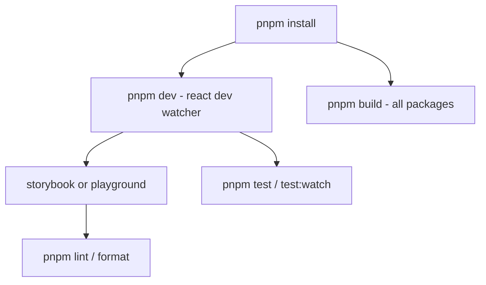

# Getting started

## Purpose

Get a local Kala UI development environment running: install with pnpm, build the packages, run the dev watcher, launch the Storybook or the Next.js playground, and run tests and lint. The repo is a pnpm workspace with a root orchestrator `package.json` and per-package scripts in `packages/*` and `apps/*`.

## Implementation map

- **Root orchestration** — `package.json` defines filtered workspace commands (`pnpm --filter ...`) that fan out to all packages. This is your entry point for nearly every task.
- **`@kala-ui/react`** (`packages/react/package.json`) — core component library. Builds with `tsc` plus `scripts/add-js-extensions.mjs`, PostCSS over `src/styles/globals.css`, and copies  /  to `dist/styles/`. Also hosts Storybook (`storybook dev -p 6006`) and token tests (`src/styles/tokens.test.ts`).
- **`@kala-ui/react-app`** (`packages/react-app/package.json`) — app-layer package; same tsc + add-js-extensions build, PostCSS over . Tests via vitest.
- **`@kala-ui/react-hooks`** (`packages/react-hooks/package.json`) — hooks package built with `tsdown` (`dev: tsdown --watch`). Tests via vitest.
- **Playground** (`apps/playground/package.json`) — Next.js app: `next dev`, `next build`, `next start`.
- **Guard scripts** — `scripts/check-package-boundaries.mjs` (run by root `lint`) and `scripts/test-storybook.mjs` (run by root `test-storybook`).
- Structural context: see [Architecture](architecture.md); component and hook contents: and  Docs surface: [Storybook Documentation](features/storybook-documentation.md). Live exercise surface: [Playground App](features/playground-app.md). Test strategy detail: [Testing strategy](testing.md).

## Key flows

Typical loop:

Common commands (run from the repo root):

- **Install**: `pnpm install`
- **Dev**: `pnpm dev` → runs the `@kala-ui/react` dev watcher. For hooks watch mode, run `pnpm --filter @kala-ui/react-hooks dev`. For the Next.js playground: (uses `next dev`).
- **Build**: `pnpm build` builds all `packages/**`; `pnpm build:apps` builds `apps/**`; `pnpm build:react` builds only `@kala-ui/react`.
- **Test**: `pnpm test` runs vitest across all packages; `pnpm test:watch` and `pnpm test:coverage` target only `@kala-ui/react` and `@kala-ui/react-app`.
- **Lint/format**: `pnpm lint` (checks package boundaries first), `pnpm lint:fix`, `pnpm lint:fix-unsafe`, `pnpm format`.
- **Storybook**: `pnpm storybook` (port 6006), `pnpm build-storybook`, `pnpm test-storybook` (runs `scripts/test-storybook.mjs`).

## Working notes

- Use **pnpm** (workspace filters depend on it). Always invoke the root scripts rather than running per-package scripts unless you're targeting one package.
- `@kala-ui/react` and `@kala-ui/react-app` builds are multi-step: `tsc` → `scripts/add-js-extensions.mjs` → PostCSS on the package CSS → copy theme/helper CSS (react only). If styles look stale, rerun `build`, not just `tsc`.
- Token changes in `packages/react/src/styles/` should be validated with `pnpm --filter @kala-ui/react test:tokens`, which rebuilds first. See [Token-Driven Theming](features/token-driven-theming.md).
- Linting uses Biome per package (`biome lint` in react/react-app, `biome check` in react-hooks). The root `lint` also enforces package boundaries via `scripts/check-package-boundaries.mjs` — keep package imports within allowed boundaries.
- `test:watch` / `test:coverage` at the root deliberately cover only `@kala-ui/react` and `@kala-ui/react-app`; run hooks tests via `pnpm --filter @kala-ui/react-hooks test`.
- Storybook source and stories live in `packages/react`; see [Storybook Documentation](features/storybook-documentation.md).

## Evidence

| Source | Detail |
|---|---|
| `package.json` | Root filtered scripts: `dev`, `build`, `build:apps`, `build:react`, `lint`, `lint:fix`, `format`, `test`, `test:watch`, `test:coverage`, `storybook`, `build-storybook`, `test-storybook` |
| `packages/react/package.json` | tsc + add-js-extensions + PostCSS build, `test:tokens`, `storybook dev -p 6006`, biome lint |
| `packages/react-app/package.json` | tsc + add-js-extensions + PostCSS (`app.css`) build, vitest |
| `packages/react-hooks/package.json` | `tsdown` build/watch, biome check, vitest |
| `apps/playground/package.json` | `next dev` / `next build` / `next start` |
| `scripts/check-package-boundaries.mjs` | Boundary check invoked by root `lint` |
| `scripts/test-storybook.mjs` | Storybook test runner invoked by root `test-storybook` |