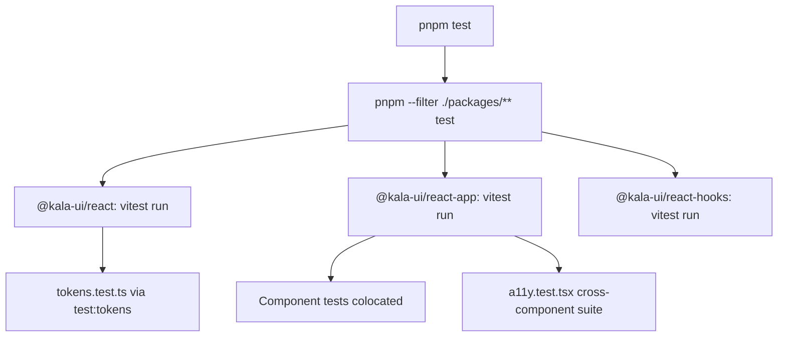

# Testing strategy

## Purpose
Kala UI validates its packages through Vitest unit/component tests per package, plus Storybook interaction tests. Tests live next to source (`*.test.ts(x)`), with per-package scripts orchestrated from the root via pnpm filters. The audit log reports ~3406 react tests across 164 files plus 22 hooks tests as the current baseline.

## Implementation map
- Root orchestration (`package.json`): `pnpm test` runs ; `pnpm test:watch` and `pnpm test:coverage` filter to `@kala-ui/react` and `@kala-ui/react-app` only.
- `@kala-ui/react` (`packages/react/package.json`): `test` / `test:watch` / `test:coverage` via Vitest; special `test:tokens` builds first then runs `src/styles/tokens.test.ts` — the token contract for the theming system (see [Token-Driven Theming](features/token-driven-theming.md)).
- `@kala-ui/react-hooks` (`packages/react-hooks/src/__tests__/`): one test file per hook (`use-debounce`, `use-focus-trap`, `use-hotkeys`, `use-idle`, `use-intersection`, etc.) plus `setup.ts`; run via `vitest run` (see [React Hooks Collection](features/react-hooks-collection.md)).
- `@kala-ui/react-app` (`packages/react-app/`): `vitest.config.ts` config; component tests colocated under  and a global `src/__tests__/a11y.test.tsx` with `src/__tests__/setup.ts` (see [Architecture](architecture.md)).
- React-app test clusters:
  - Application chrome: `app-shell.test.tsx`, `header/header.test.tsx`, `header-skeleton.test.tsx`, `sidebar/`, `navigation/`, `footer`, `nav-link` ([Application Chrome Composites](features/application-chrome-composites.md)).
  - Charts: `charts/chart.test.tsx`, `area-chart`, `bar-chart`, `line-chart`, `donut-chart`, `radial-bar-chart`, `chart-skeleton`, `theme-utils.test.ts`, `use-theme-aware-chart.test.ts`, `utils.test.ts`; plus `sparkline-chart` ([Charts](features/charts.md)).
  - Data table: `data-table/` covering filters, toolbar, chips, pagination, `useTableState`, skeletons.
  - Cards/auth: `metric-card/`, `session-card/`, `social-login-button(s)`, `user-menu-dropdown/`, `dnd/dnd.test.tsx`.
- Storybook interaction tests: root script `pnpm test-storybook` → `node scripts/test-storybook.mjs` (see [Storybook Documentation](features/storybook-documentation.md)).
- `scripts/add-kala-markers.mjs` skips  and  files, so codemods ignore test/stories sources.

## Key flows
Tests are per-package; the root scripts fan out with pnpm filters. The accessibility suite in `react-app` is a cross-cutting validation that renders composites (AppShell, Header, Sidebar, DataTable, charts, MetricCard, SessionCard, UserMenuDropdown) and checks a11y expectations.

## Working notes
- Use `pnpm test` for the full suite; `pnpm test:watch` and `pnpm test:coverage` cover only `@kala-ui/react` and `@kala-ui/react-app` (hooks is excluded from those root scripts — run `pnpm --filter @kala-ui/react-hooks test` directly).
- `test:tokens` in `@kala-ui/react` requires a build first (`pnpm build && vitest run src/styles/tokens.test.ts`) — run it after style/token changes.
- Per-package commands: `vitest run` (CI-style), `vitest` (watch), `vitest run --coverage`.
- Most react-app components have a parallel  for loading states — when adding a new component with a skeleton, add both tests.
- The a11y suite references many components at once; changing a composite's DOM/roles may break `src/__tests__/a11y.test.tsx`.
- Storybook interaction tests: `pnpm test-storybook` (root) — requires stories to include play functions.
- Pre-release verification per the audit doc: full test suite, biome lint clean, build, and Storybook build.
- Related commands: `lint` also checks package boundaries (`scripts/check-package-boundaries.mjs`); see [Getting started](getting-started.md).

## Evidence
| Item | Location |
|---|---|
| Root test scripts | package.json (`test`, `test:watch`, `test:coverage`, `test-storybook`) |
| Vitest config | packages/react-app/vitest.config.ts |
| Token tests | packages/react/src/styles/tokens.test.ts (`test:tokens`) |
| A11y suite | packages/react-app/src/__tests__/a11y.test.tsx |
| Hooks tests | packages/react-hooks/src/__tests__/ |
| Per-package scripts | packages/{react,react-app,react-hooks}/package.json |
| Storybook test runner | scripts/test-storybook.mjs |
| Test-count baseline | docs/AUDIT-2026-08-27.md |